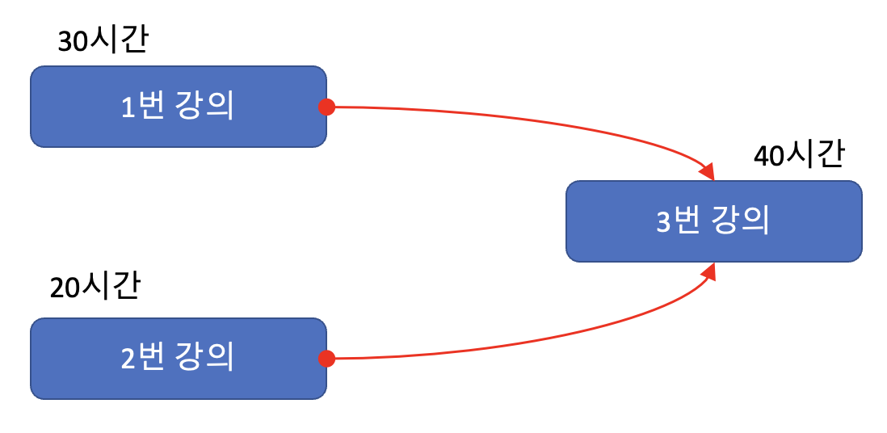

1\.&nbsp;팀 결성(team.py)
======
[문제]
------
학교에서 학생들에게 0번부터 N번까지의 번호를 부여했다. 처음에는 모든 학생이 서로 다른 팀으로 구분되어, 총 N+1 개의 팀이 존재한다. 이때 선생님은 "팀 합치기" 연산과 "같은 팀 여부 확인" 연산을 사용할 수 있다.

1. "팀 합치기" 연산은 두 팀을 합치는 연산이다.

2. "같은 팀 여부 확인" 연산은 특정한 두 학생이 같은 팀에 속하는지를 확인하는 연산이다.

선생님이 M개의 연산을 수행할 수 있을 때, "같은 팀 여부 확인" 연산에 대한 연산 결과를 출력하는 프로그램을 작성하라.

[입력 조건]
------
- 첫째 줄에 N,M이 주어진다. M은 입력으로 주어지는 연산의 개수이다.
- 다음 M개의 줄에는 각각의 연산이 주어진다.
- "팀 합치기" 연산은 0 a b  형태로 주어진다. 이는 a번 학생이 속한 팀과 b번 학생이 속한 팀을 합친다는 의미이다.
- "같은 팀 여부 확인" 연산은 1 a b 형태로 주어진다. 이는 a번 학생과 b번 학생이 같은 팀에 속해 있는지를 확인하는 연산이다.
- a와 b는 N이하의 양의 정수이다.

[출력 조건]
------
- "같은 팀 여부 확인" 연산에 대하여 한 줄에 하나씩 YES 혹은 NO로 결과를 출력한다.

[입력 예시]
-----
~~~
7 8
0 1 3
1 1 7
0 7 6
1 7 1
0 3 7
0 4 2
0 1 1
1 1 1
~~~
[출력 예시]
------
~~~
NO
NO
YES
~~~

2\.&nbsp;도시 분할 계획(cityDivide.py)
======
[문제]
------
동물원에서 막 탈출한 원숭이 한 마리가 세상구경을 하고 있다. 그러다가 평화로운 마을에 가게 되었는데, 그곳에서는 알 수 없는 일이 벌어지고 있었다.

마을은 N개의 집과 그 집들을 연결하는 M개의 길로 이루어져 있다. 길은 어느 방향으로든지 다닐 수 있는 편리한 길이다. 그리고 각 길마다 길을 유지하는데 드는 유지비가 있다.

마을의 이장은 마을을 두 개의 분리된 마을로 분할할 계획을 가지고 있다. 마을이 너무 커서 혼자서는 관리할 수 없기 때문이다. 마을을 분할할 때는 각 분리된 마을 안에 집들이 서로 연결되도록 분할해야 한다. 각 분리된 마을 안에 있는 임의의 두 집 사이에 경로가 항상 존재해야 한다는 뜻이다. 마을에는 집이 하나 이상 있어야 한다.

그렇게 마을의 이장은 계획을 세우다가 마을 안에 길이 너무 많다는 생각을 하게 되었다. 일단 분리된 두 마을 사이에 있는 길들은 필요가 없으므로 없앨 수 있다. 그리고 각 분리된 마을 안에서도 임의의 두 집 사이에 경로가 항상 존재하게 하면서 길을 더 없앨 수 있다. 마을의 이장은 위 조건을 만족하도록 길들을 모두 없애고 나머지 길의 유지비의 합을 최소로 하고 싶다. 이것을 구하는 프로그램을 작성하시오.

[입력 조건]
------
 - 첫째 줄에 집의 개수 N, 길의 개수 M이 주어진다. N은 2 이상 100,000 이하인 정수이고, M은 1 이상 1,000,000 이하인 정수이다.
- 그 다음 줄부터 M줄에 걸쳐 길의 정보가 A, B, C 3개의 정수로 공백으로 구분되어 주어지는데  A번 집과 B번 집을 연결하는 길의 유지비가 C(1 <= C <= 1,000) 라는 뜻이다.

[출력 조건]
------
- 첫째 줄에 길을 없애고 남은 유지비 합의 최솟값을 출력한다.

[입력 예시]
-----
~~~
7 12
1 2 3
1 3 2
3 2 1
2 5 2
3 4 4
7 3 6
5 1 5
1 6 2
6 4 1 
6 5 3
4 5 3
6 7 4
~~~
[출력 예시]
------
~~~
8
~~~

2\.&nbsp;커리큘럼(curriculum.py)
======
[문제]
------
철수는 온라인으로 컴퓨터공학강의를 듣고 있다. 
이때 각 온라인강의는 선수강의가 있을 수 있는데, 선수 강의가 있는 강의는 선수 강의를 먼저. 들어야만 해당강의를 들을 수 있다. 
예를들어 '알고리즘’ 강의의 선수 강의로 '자료구조'가 존재한다면, ‘자료구조를 들은 이후에 ‘알고리즘' 강의를 들을 수 있다. 
철수는 총 N개의 강의를 듣고자 한다. 모든 강의는 1번부터 N번까지의 번호를 가진다. 
또한 동시에 여러 개의 강의를 들을 수 있다고 가정한다. 
예를 들어 N=3일 때, 3번강의의 선수 강의로 1번과 2번강의가 있고, 1번과 2번강의는 선수강의가 없다고 가정하자. 
그리고 각 강의에 대하여 강의 시간이 다음과 같다고 가정하자. 
1번 강의: 30시간 
2번 강의: 20시간 
3번 강의: 40시간 

이 경우 1번 강의를 수강하기까지의 최소 시간은 30시간, 2번 강의를 수강하기까지의 최소 시간은 20시간, 3번 강의를 수강하기까지의 최소 시간은 70시간이다.

철수가 듣고자 하는 N개의 강의 정보가 주어졌을 때, N개의 강의에 대하여 수강하기까지 걸리는 최소 시간을 각각 출력하는 프로그램을 작성하시오.

[입력 조건]
------
- 첫째줄에 철수가 듣고자 하는 강의의 수 N(1≤N≤500)이 주어진다.

- 다음 N개의 줄에는 각 강의의 강의 시간과 그. 강의를 듣기 위해 먼저 들어야하는 강의들의 번호가 자연수로 주어지며, 각. 자연수는 공백으로 구분한다. 이때 강의시간은 100,000이하의 자연수이다.
- 각 강의번호는 1부터 N까지로 구성되며. 각줄은 -1로 끝난다.

[출력 조건]
------
- N개의 강의에 대하여 수강하기 까지 걸리는 최소 시간을 한 줄에 하나씩 출력한다. 

[입력 예시]
-----
~~~
5
10 -1
10 1 -1
4 1 -1
4 3 1 -1
3 3 -1
~~~
[출력 예시]
------
~~~
10
20
14
18
17
~~~