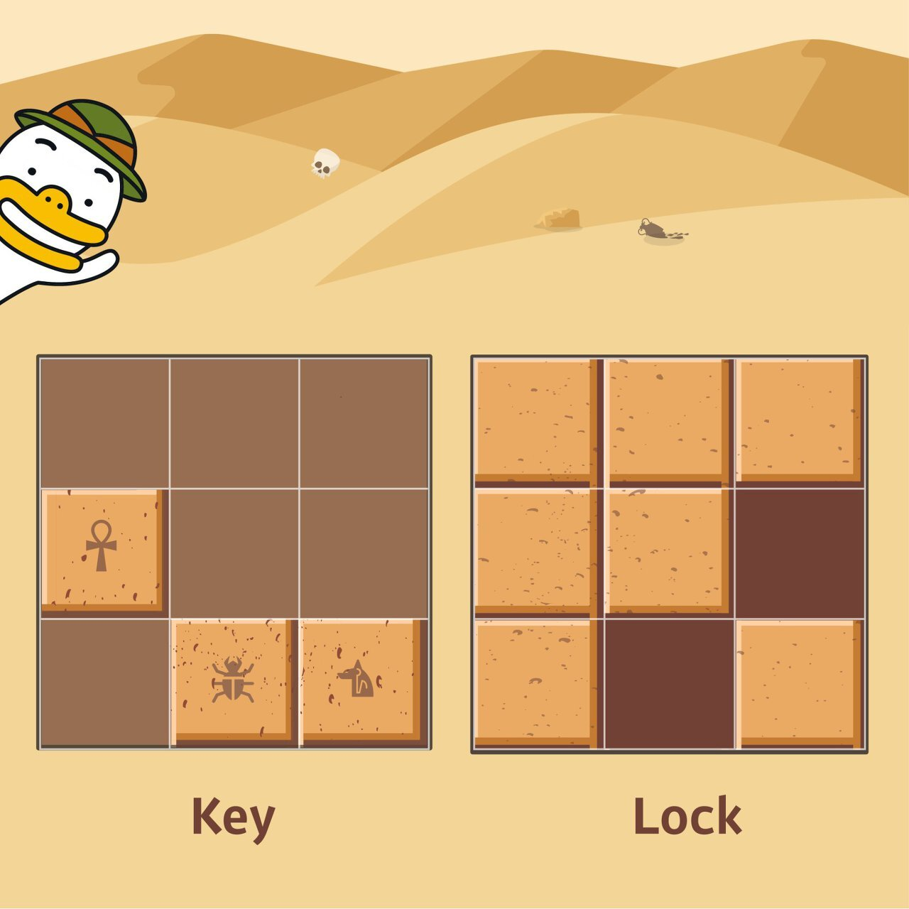
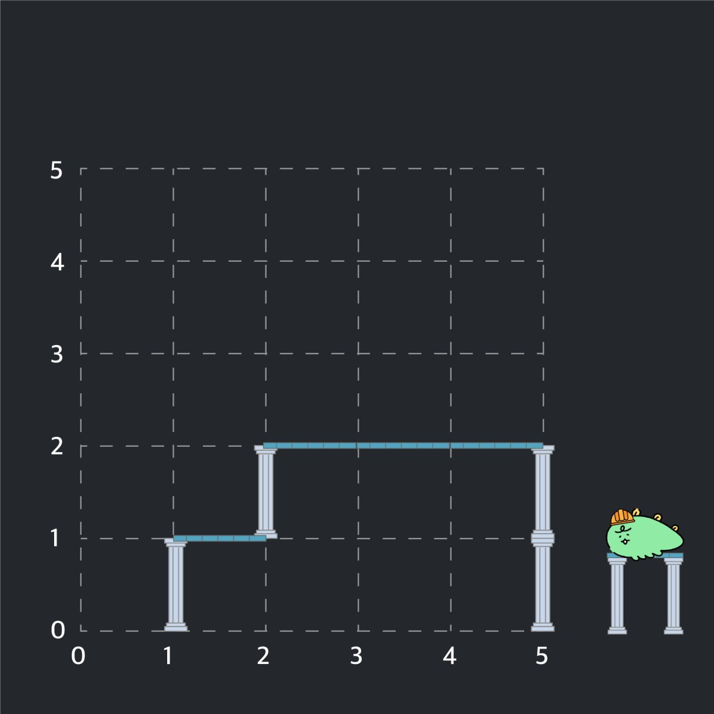
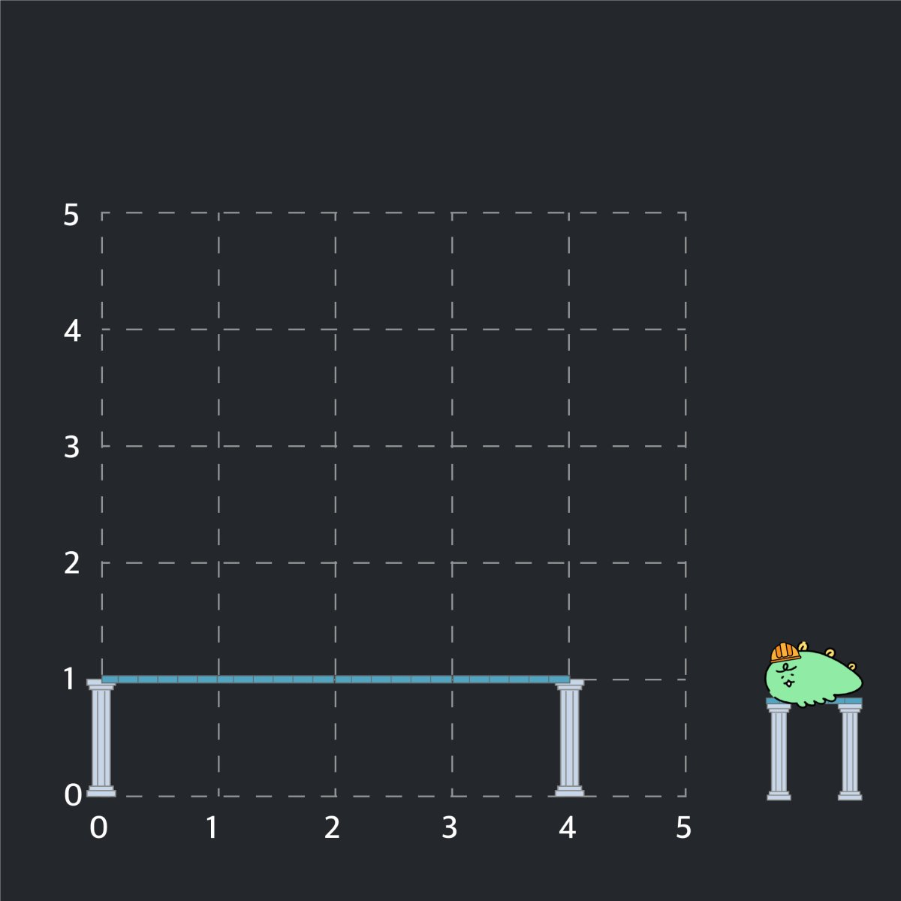

1\.&nbsp;상하좌우(lrud.py)
======
[문제]
------
여행가 A는 N * N 크기의 정사각형 공간 위에 있다. 이 공간은 1 * 1 크기의 정사각형으로 나누어져 있다. 가장 왼쪽 위 좌표는 (1, 1)이며, 가장 오른쪽 아래 좌표는 (N, N)에 해당한다. 여행가 A는 상하좌우 방향으로 이동할 수 있으며, 시작 좌표는 항상 (1,1)이다. 우리 앞에는 여행가 A가 이동할 계획이 적힌 계획서가 놓여있다.

계획서에는 하나의 줄에 띄어쓰기를 기준으로 하여 L, R, U, D 중 하나의 문자가 반복적으로 적혀있다. 이때 여행가 A가 N*N 크기의 공간을 벗어나는 움직임은 무시된다. 최종적으로 도착할 지점의 좌표를 출력하는 프로그램을 작성하시오.

[입력 조건]
------
- 첫째 줄에 공간의 크기를 나타내는 N이 주어진다. (1 <= N <= 100)
- 둘째 줄에 여행가 A가 이동할 계획서 내용이 주어진다.
(1 <= 이동 횟수 <= 100)

[출력 조건]
------
- 첫째 줄에 여행가 A가 최종적으로 도착할 지점의 좌표(X, Y)를 공백으로 구분하여 출력한다.
<br>

2\.&nbsp;시각(time.py)
======
[문제]
------
정수 N이 입력되면 00시 00분 00초부터 N시 59분 59초까지의 모든 시각 중에서 3이 하나라도 포함되는 모든 경우의 수를 구하는 프로그램을 작성하시오.

[입력 조건]
------
- 첫째 줄에 정수 N이 입력된다. (0 <= N <= 23)

[출력 조건]
------
- 00시 00분 00초부터 N시 59분 59초까지의 모든 시각 중에서 3이 하나라도 포함되는 모든 경우의 수를 출력한다.
<br>

3\.&nbsp;왕실의 나이트(knight.py)
======
[문제]
------
행복 왕국의 왕실 정원은 체스판과 같은 8 × 8 좌표 평면이다. 왕실 정원의 특정한 한 칸에 나이트가 서있다.
나이트는 매우 충성스러운 신하로서 매일 무술을 연마한다
나이트는 말을 타고 있기 때문에 이동을 할 때는 L자 형태로만 이동할 수 있으며 정원 밖으로는 나갈 수 없다
나이트는 특정 위치에서 다음과 같은 2가지 경우로 이동할 수 있다

    1. 수평으로 두 칸 이동한 뒤에 수직으로 한 칸 이동하기
    2. 수직으로 두 칸 이동한 뒤에 수평으로 한 칸 이동하기


이처럼 8 × 8 좌표 평면상에서 나이트의 위치가 주어졌을 때 나이트가 이동할 수 있는 경우의 수를 출력하는
프로그램을 작성하라. 왕실의 정원에서 행 위치를 표현할 때는 1부터 8로 표현하며, 열 위치를 표현할 때는
a 부터 h로 표현한다

    c2에 있을 때 이동할 수 있는 경우의 수는 6가지이다
    a1에 있을 때 이동할 수 있는 경우의 수는 2가지이다
[입력 조건]
------
- 첫째 줄에 8x8 좌표 평면상에서 현재 나이트가 위치한 곳의 좌표를 나타내는 두 문자로 구성된 문자열이 입력된다. 입력 문자는 a1 처럼 열과 행으로 이뤄진다.

[출력 조건]
------
- 첫째 줄에 나이트가 이동할 수 있는 경우의 수를 출력하시오.
<br>

4\.&nbsp;게임개발(game.py)
======
[문제]
------
현민이는 게임 캐릭터가 맵 안에서 움직이는 시스템을 개발 중이다. 캐릭터가 있는 장소는 1 X 1 크기의 정사각형으로 이뤄진 N X M 크기의 직사각형으로, 각각의 칸은 육지 또는 바다이다. 캐릭터는 동서남북 중 한 곳을 바라본다.

맵의 각 칸은 (A, B)로 나타낼 수 있고, A는 북쪽으로부터 떨어진 칸의 개수, B는 서쪽으로부터 떨어진 칸의 개수이다. 캐릭터는 상하좌우로 움직일 수 있고, 바다로 되어 있는 공간에는 갈 수 없다. 캐릭터의 움직임을 설정하기 위해 정해 놓은 매뉴얼은 이러하다.

  1. 현재 위치에서 현재 방향을 기준으로 왼쪽 방향(반시계 방향으로 90도 회전한 방향)부터 차례대로 갈 곳을 정한다.

  2. 캐릭터의 바로 왼쪽 방향에 아직 가보지 않은 칸이 존재한다면, 왼쪽 방향으로 회전한 다음 왼쪽으로 한 칸을 전진한다. 왼쪽 방향에 가보지 않은 칸이 없다면, 왼쪽 방향으로 회전만 수행하고 1단계로 돌아간다.

  3. 만약 네 방향 모두 이미 가본 칸이거나 바다로 되어 있는 칸인 경우에는, 바라보는 방향을 유지한 채로 한 칸 뒤로 가고 1단계로 돌아간다. 단, 이때 뒤쪽 방향이 바다인 칸이라 뒤로 갈 수 없는 경우에는 움직임을 멈춘다.

현민이는 위 과정을 반복적으로 수행하면서 캐릭터의 움직임에 이상이 있는지 테스트하려고 한다. 메뉴얼에 따라 캐릭터를 이동시킨 뒤에, 캐릭터가 방문한 칸의 수를 출력하는 프로그램을 만드시오.

[입력 조건]
------
- 첫째 줄에 맵의 세로 크기 N과 가로 크기 M을 공백으로 구분하여 입력한다.
(3 <= N, M <= 50)

- 둘째 줄에 게임 캐릭터가 있는 칸의 좌표 (A, B)와 바라보는 방향 d가 각각 서로 공백으로 구분하여 주어진다. 방향 d의 값으로는 다음과 같이 4가지가 존재한다.

      0 : 북쪽
      1 : 동쪽
      2 : 남쪽
      3 : 서쪽

- 셋째 줄부터 맵이 육지인지 바다인지에 대한 정보가 주어진다. N개의 줄에 맵의 상태가 북쪽부터 남쪽 순서대로, 각 줄의 데이터는 서쪽부터 동쪽 순서대로 주어진다. 맵의 외곽은 항상 바다로 되어 있다.

      0 : 육지
      1 : 바다
- 처음에 게임 캐릭터가 위치한 칸의 상태는 항상 육지이다.

[출력 조건]
------
- 첫째 줄에 이동을 마친 후 캐릭터가 방문한 칸의 수를 출력한다.

[입력 예시]
-----

    4 4
    1 1 0     //(1, 1)에 북쪽(0)을 바라보고 서 있는 캐릭터
    1 1 1 1   //첫째 줄은 모두 바다
    1 0 0 1   //둘째 줄은 바다, 육지, 육지, 바다
    1 1 0 1   //셋째 줄은 바다, 바다, 육지, 바다
    1 1 1 1   //넷째 줄은 모두 바다

[출력 예시]
-----
3

5\.&nbsp;럭키 스트레이트(luckyStraight.py)
======
[문제]
------
게임의 아웃복서 캐릭터는 필살기인 '럭키 스트레이트' 기술이 있습니다. 이 기술은 매우 강력한 대신에 게임 내에서
점수가 특정 조건을 만족할 때만 사용할 수 있습니다.

특정 조건이란 현재 캐릭터의 점수를 N이라고 할 때 자릿수를 기준으로 점수 N을 반으로 나누어 왼쪽 부분의 각
자릿수의 합과 오른쪽 부분의 각 자릿수의 합을 더한 값이 동일한 상황을 의미합니다.

예를 들어 현재 점수가 123,402라면 왼쪽 부분의 각 자릿수의 합은 1 + 2 + 3, 오른쪽 부분의 각 자릿수의 합은
4 + 0 + 2이므로 두 합이 6으로 동일하여 럭키 스트레이트를 사용할 수 있습니다.

현재 점수 N이 주어지면 럭키 스트레이트를 사용할 수 있는 상태인지 아닌지를 알려주는 프로그램을 작성하세요.

[입력 조건]
------
- 첫째 줄에 점수 N이 정수로 주어집니다. (10 ≤ N ≤ 99,999,999) 단, 점수 N의 자릿수는 항상 짝수 형태로만 주어집니다. 예를 들어 자릿수가 5인 12,345와 같은 수는 입력으로 들어오지 않습니다.

[출력 조건]
------
- 첫째 줄에 럭키 스트레이트를 사용할 수 있다면 "LUCKY"를, 사용할 수 없다면 "READY"를 출력합니다

[입력 예시]
-----
1.```123402```

2.```7755```

[출력 예시]
-----
1.```LUCKY```

2.```READY```

6\.&nbsp;문자열 재정렬(rearrangeString.py)
======
[문제]
------
알파벳 대문자와 숫자(0 ~ 9)로만 구성된 문자열이 입력으로 주어집니다. 이때 모든 알파벳을 오름차순으로 정렬하여 이어서 출력한 뒤에, 그 뒤에 모든 숫자를 더한 값을 이어서 출력합니다.

예를 들어 K1KA5CB7이라는 값이 들어오면 ABCKK13을 출력합니다.
[입력 조건]
------
- 첫째 줄에 하나의 문자열 S가 주어집니다. (1 ≤ S의 길이 ≤10,000)

[출력 조건]
------
- 첫째 줄에 문제에서 요구하는 정답을 출력합니다.

[입력 예시]
-----
1. ```K1KA5CB7```
2. ```AJKDLSI412KJ4JSJ9D```

[출력 예시]
-----
1.```ABCKK13```

2.```ADDIJJJKKLSS20```

7\.&nbsp;문자열 압축(compressString.py)
======
[문제]
------
데이터 처리 전문가가 되고 싶은 "어피치"는 문자열을 압축하는 방법에 대해 공부를 하고 있습니다. 최근에 대량의 데이터 처리를 위한 간단한 비손실 압축 방법에 대해 공부를 하고 있는데, 문자열에서 같은 값이 연속해서 나타나는 것을 그 문자의 개수와 반복되는 값으로 표현하여 더 짧은 문자열로 줄여서 표현하는 알고리즘을 공부하고 있습니다.<br>
간단한 예로 "aabbaccc"의 경우 "2a2ba3c"(문자가 반복되지 않아 한번만 나타난 경우 1은 생략함)와 같이 표현할 수 있는데, 이러한 방식은 반복되는 문자가 적은 경우 압축률이 낮다는 단점이 있습니다. 예를 들면, "abcabcdede"와 같은 문자열은 전혀 압축되지 않습니다. "어피치"는 이러한 단점을 해결하기 위해 문자열을 1개 이상의 단위로 잘라서 압축하여 더 짧은 문자열로 표현할 수 있는지 방법을 찾아보려고 합니다.<br>

예를 들어, "ababcdcdababcdcd"의 경우 문자를 1개 단위로 자르면 전혀 압축되지 않지만, 2개 단위로 잘라서 압축한다면 "2ab2cd2ab2cd"로 표현할 수 있습니다. 다른 방법으로 8개 단위로 잘라서 압축한다면 "2ababcdcd"로 표현할 수 있으며, 이때가 가장 짧게 압축하여 표현할 수 있는 방법입니다.

다른 예로, "abcabcdede"와 같은 경우, 문자를 2개 단위로 잘라서 압축하면 "abcabc2de"가 되지만, 3개 단위로 자른다면 "2abcdede"가 되어 3개 단위가 가장 짧은 압축 방법이 됩니다. 이때 3개 단위로 자르고 마지막에 남는 문자열은 그대로 붙여주면 됩니다.

압축할 문자열 s가 매개변수로 주어질 때, 위에 설명한 방법으로 1개 이상 단위로 문자열을 잘라 압축하여 표현한 문자열 중 가장 짧은 것의 길이를 return 하도록 solution 함수를 완성해주세요.
[제한 사항]
------
- s의 길이는 1 이상 1,000 이하입니다.
- s는 알파벳 소문자로만 이루어져 있습니다.

[입출력 예시]
------
|s|	result|
|----|----|----|
|"aabbaccc"	|7|
|"ababcdcdababcdcd"	|9|
|"abcabcdede"|	8|
|"abcabcabcabcdededededede"|	14|
|"xababcdcdababcdcd"	|17|

[입출력 예시에 대한 설명]
-----
**입출력 예시 #1**

    문자열을 1개 단위로 잘라 압축했을 때 가장 짧습니다.

**입출력 예시 #2**

    문자열을 8개 단위로 잘라 압축했을 때 가장 짧습니다.

**입출력 예시 #3**

    문자열을 3개 단위로 잘라 압축했을 때 가장 짧습니다.

**입출력 예시 #4**

    문자열을 2개 단위로 자르면 "abcabcabcabc6de" 가 됩니다.
    문자열을 3개 단위로 자르면 "4abcdededededede" 가 됩니다.
    문자열을 4개 단위로 자르면 "abcabcabcabc3dede" 가 됩니다.
    문자열을 6개 단위로 자를 경우 "2abcabc2dedede"가 되며, 이때의 길이가 14로 가장 짧습니다.

**입출력 예시 #5**

    문자열은 제일 앞부터 정해진 길이만큼 잘라야 합니다.
    따라서 주어진 문자열을 x / ababcdcd / ababcdcd 로 자르는 것은 불가능 합니다.
    이 경우 어떻게 문자열을 잘라도 압축되지 않으므로 가장 짧은 길이는 17이 됩니다.

8\.&nbsp;자물쇠와 열쇠(lockAndKey.py)
======
[문제]
------
고고학자인 “튜브”는 고대 유적지에서 보물과 유적이 가득할 것으로 추정되는 비밀의 문을 발견하였습니다. 그런데 문을 열려고 살펴보니 특이한 형태의 자물쇠로 잠겨 있었고 문 앞에는 특이한 형태의 열쇠와 함께 자물쇠를 푸는 방법에 대해 다음과 같이 설명해 주는 종이가 발견되었습니다.

잠겨있는 자물쇠는 격자 한 칸의 크기가 1 x 1인 N x N 크기의 정사각 격자 형태이고 특이한 모양의 열쇠는 M x M 크기인 정사각 격자 형태로 되어 있습니다.

자물쇠에는 홈이 파여 있고 열쇠 또한 홈과 돌기 부분이 있습니다. 열쇠는 회전과 이동이 가능하며 열쇠의 돌기 부분을 자물쇠의 홈 부분에 딱 맞게 채우면 자물쇠가 열리게 되는 구조입니다. 자물쇠 영역을 벗어난 부분에 있는 열쇠의 홈과 돌기는 자물쇠를 여는 데 영향을 주지 않지만, 자물쇠 영역 내에서는 열쇠의 돌기 부분과 자물쇠의 홈 부분이 정확히 일치해야 하며 열쇠의 돌기와 자물쇠의 돌기가 만나서는 안됩니다. 또한 자물쇠의 모든 홈을 채워 비어있는 곳이 없어야 자물쇠를 열 수 있습니다.

열쇠를 나타내는 2차원 배열 key와 자물쇠를 나타내는 2차원 배열 lock이 매개변수로 주어질 때, 열쇠로 자물쇠를 열수 있으면 true를, 열 수 없으면 false를 return 하도록 solution 함수를 완성해주세요.
[제한 사항]
------
- key는 M x M(3 ≤ M ≤ 20, M은 자연수)크기 2차원 배열입니다.
- lock은 N x N(3 ≤ N ≤ 20, N은 자연수)크기 2차원 배열입니다.
- M은 항상 N 이하입니다.
- key와 lock의 원소는 0 또는 1로 이루어져 있습니다. 이때 0은 홈 부분, 1은 돌기 부분을 나타냅니다.

[입출력 예시]
------
|key|	lock|result
|----|----|----|
|[[0,0,0], [1,0,0], [0,1,1]]|[[1,1,1],[1,1,0],[1,0,1]]|true

[입출력 예시에 대한 설명]
-----
key를 시계방향으로 90도 회전하고, 오른쪽으로 한 칸, 아래로 한 칸 이동하면 lock의 홈 부분을 정확히 모두 채울 수 있습니다.<br>



9\.&nbsp;뱀(snake.py)
======
[문제]
------
'Dummy'라는 도스 게임이 있습니다. 이 게임에는 뱀이 나와서 기어 다니는데, 사과를 먹으면 뱀 길이가 늘어납니다.

뱀이 이리저리 기어 다니다가 벽 또는 자기 자신의 몸과 부딪히면 게임이 끝납니다.

게임은 N x N 정사각 보드 위에서 진행되고, 몇몇 칸에는 사과가 놓여져 있습니다. 보드의 상하좌우 끝에는 벽이 있습니다.

게임을 시작할 때 뱀은 맨 위 맨 좌측에 위치하고 뱀의 길이는 1입니다. 뱀은 처음에 오른쪽을 향합니다.

뱀은 매 초마다 이동을 하는데 다음과 같은 규칙을 따릅니다.

1. 먼저 뱀은 몸길이를 늘려 머리를 다음 칸에 위치시킵니다.

2. 만약 이동한 칸에 사과가 있다면, 그 칸에 있던 사과가 없어지고 꼬리는 움직이지 않습니다.

3. 만약 이동한 칸에 사과가 없다면, 몸길이를 줄여서 꼬리가 위치한 칸을 비워줍니다. 즉, 몸길이는 변하지 않습니다.

사과의 위치와 뱀의 이동 경로가 주어질 때 이 게임이 몇 초만에 끝나는지 계산하세요.

[입력 조건]
------
- 첫째 줄에 보드의 크기 N이 주어집니다. (2 <= N <= 100) 다음 줄에 사과의 개수 K가 주어집니다. (0 <= K <= 100)

- 다음 K개의 줄에는 사과의 위치가 주어지는데, 첫 번째 정수는 행, 두 번째 정수는 열 위치를 의미합니다.
  - 사과의 위치는 모두 다르며, 맨 위 맨 좌측(1행 1열)에는 사과가 없습니다.

- 다음 줄에는 뱀의 방향 변환 횟수 L이 주어집니다. (1 <= L <= 100)

- 다음 L개의 줄에는 뱀의 방향 변환 정보가 주어지는데, 정수 X와 문자 C로 이루어져 있으며, 게임 시작 시간으로부터 X초가 끝난 뒤에 왼쪽(C가 'L') 또는 오른쪽(C가 'D')으로 90도 방향을 회전시킨다는 뜻입니다.
    - X는 10,000 이하의 양의 정수이며, 방향 전환 정보는 X가 증가하는 순으로 주어집니다.

[출력 조건]
-----
- 첫째 줄에 게임이 몇 초에 끝나는지 출력합니다.

[입력 예시]
-----
입력 1
~~~
6
3
3 4
2 5
5 3
3
3 D
15 L
17 D
~~~
입력2
~~~
10
4
1 2
1 3
1 4
1 5
4
8 D
10 D
11 D
13 L
~~~
입력3
~~~
10
5
1 5
1 3
1 2
1 6
1 7
4
8 D
10 D
11 D
13 L
~~~
[출력 예시]
----
출력 1
~~~
9
~~~
출력 2
~~~
21
~~~
출력 3
~~~
13
~~~

10\.&nbsp;기둥과 보(pillar.py)
======
[문제]
------
빙하가 깨지면서 스노우타운에 떠내려 온 "죠르디"는 인생 2막을 위해 주택 건축사업에 뛰어들기로 결심하였습니다. "죠르디"는 기둥과 보를 이용하여 벽면 구조물을 자동으로 세우는 로봇을 개발할 계획인데, 그에 앞서 로봇의 동작을 시뮬레이션 할 수 있는 프로그램을 만들고 있습니다.
프로그램은 2차원 가상 벽면에 기둥과 보를 이용한 구조물을 설치할 수 있는데, 기둥과 보는 길이가 1인 선분으로 표현되며 다음과 같은 규칙을 가지고 있습니다.

- 기둥은 바닥 위에 있거나 보의 한쪽 끝 부분 위에 있거나, 또는 다른 기둥 위에 있어야 합니다.
- 보는 한쪽 끝 부분이 기둥 위에 있거나, 또는 양쪽 끝 부분이 다른 보와 동시에 연결되어 있어야 합니다.
    - 단, 바닥은 벽면의 맨 아래 지면을 말합니다.

2차원 벽면은 n x n 크기 정사각 격자 형태이며, 각 격자는 1 x 1 크기입니다. 맨 처음 벽면은 비어있는 상태입니다. 기둥과 보는 격자선의 교차점에 걸치지 않고, 격자 칸의 각 변에 정확히 일치하도록 설치할 수 있습니다. 다음은 기둥과 보를 설치해 구조물을 만든 예시입니다.



예를 들어, 위 그림은 다음 순서에 따라 구조물을 만들었습니다.

1. (1, 0)에서 위쪽으로 기둥을 하나 설치 후, (1, 1)에서 오른쪽으로 보를 하나 만듭니다.
2. (2, 1)에서 위쪽으로 기둥을 하나 설치 후, (2, 2)에서 오른쪽으로 보를 하나 만듭니다.
3. (5, 0)에서 위쪽으로 기둥을 하나 설치 후, (5, 1)에서 위쪽으로 기둥을 하나 더 설치합니다.
4. (4, 2)에서 오른쪽으로 보를 설치 후, (3, 2)에서 오른쪽으로 보를 설치합니다.

만약 (4, 2)에서 오른쪽으로 보를 먼저 설치하지 않고, (3, 2)에서 오른쪽으로 보를 설치하려 한다면 2번 규칙에 맞지 않으므로 설치가 되지 않습니다. 기둥과 보를 삭제하는 기능도 있는데 기둥과 보를 삭제한 후에 남은 기둥과 보들 또한 위 규칙을 만족해야 합니다. 만약, 작업을 수행한 결과가 조건을 만족하지 않는다면 해당 작업은 무시됩니다.

벽면의 크기 n, 기둥과 보를 설치하거나 삭제하는 작업이 순서대로 담긴 2차원 배열 build_frame이 매개변수로 주어질 때, 모든 명령어를 수행한 후 구조물의 상태를 return 하도록 solution 함수를 완성해주세요.

[제한 사항]
------
- n은 5 이상 100 이하인 자연수입니다.
- build_frame의 세로(행) 길이는 1 이상 1,000 이하입니다.
- build_frame의 가로(열) 길이는 4입니다.
- build_frame의 원소는 [x, y, a, b]형태입니다.
  - x, y는 기둥, 보를 설치 또는 삭제할 교차점의 좌표이며, [가로 좌표, 세로 좌표] 형태입니다.
  - a는 설치 또는 삭제할 구조물의 종류를 나타내며, 0은 기둥, 1은 보를 나타냅니다.
  - b는 구조물을 설치할 지, 혹은 삭제할 지를 나타내며 0은 삭제, 1은 설치를 나타냅니다.
  - 벽면을 벗어나게 기둥, 보를 설치하는 경우는 없습니다.
  - 바닥에 보를 설치 하는 경우는 없습니다.
- 구조물은 교차점 좌표를 기준으로 보는 오른쪽, 기둥은 위쪽 방향으로 설치 또는 삭제합니다.
- 구조물이 겹치도록 설치하는 경우와, 없는 구조물을 삭제하는 경우는 입력으로 주어지지 않습니다.
- 최종 구조물의 상태는 아래 규칙에 맞춰 return 해주세요.
  - return 하는 배열은 가로(열) 길이가 3인 2차원 배열로, 각 구조물의 좌표를 담고있어야 합니다.
  - return 하는 배열의 원소는 [x, y, a] 형식입니다.
  - x, y는 기둥, 보의 교차점 좌표이며, [가로 좌표, 세로 좌표] 형태입니다.
  - 기둥, 보는 교차점 좌표를 기준으로 오른쪽, 또는 위쪽 방향으로 설치되어 있음을 나타냅니다.
  - a는 구조물의 종류를 나타내며, 0은 기둥, 1은 보를 나타냅니다.
  - return 하는 배열은 x좌표 기준으로 오름차순 정렬하며, x좌표가 같을 경우 y좌표 기준으로 오름차순 정렬해주세요.
  - x, y좌표가 모두 같은 경우 기둥이 보보다 앞에 오면 됩니다.

[입출력 예시]
------
|n|build_frame|result
|----|----|----|
|5|[[1,0,0,1],[1,1,1,1],[2,1,0,1],[2,2,1,1],[5,0,0,1],[5,1,0,1],[4,2,1,1],[3,2,1,1]]|[[1,0,0],[1,1,1],[2,1,0],[2,2,1],[3,2,1],[4,2,1],[5,0,0],[5,1,0]]
|5|[[0,0,0,1],[2,0,0,1],[4,0,0,1],[0,1,1,1],[1,1,1,1],[2,1,1,1],[3,1,1,1],[2,0,0,0],[1,1,1,0],[2,2,0,1]]|[[0,0,0],[0,1,1],[1,1,1],[2,1,1],[3,1,1],[4,0,0]]|

[입출력 예시에 대한 설명]
-----
**입출력 예 #1**

문제의 예시와 같습니다.

**입출력 예 #2**

여덟 번째 작업을 수행 후 아래와 같은 구조물 만들어집니다.


- 홉 번째 작업의 경우, (1, 1)에서 오른쪽에 있는 보를 삭제하면 (2, 1)에서 오른쪽에 있는 보는 조건을 만족하지 않으므로 무시됩니다.

- 열 번째 작업의 경우, (2, 2)에서 위쪽 방향으로 기둥을 세울 경우 조건을 만족하지 않으므로 무시됩니다.

10\.&nbsp;치킨 배달(chickenDelivery.py)
======
[문제]
------
크기가 N×N인 도시가 있다. 도시는 1×1크기의 칸으로 나누어져 있다. 도시의 각 칸은 빈 칸, 치킨집, 집 중 하나이다. 도시의 칸은 (r, c)와 같은 형태로 나타내고, r행 c열 또는 위에서부터 r번째 칸, 왼쪽에서부터 c번째 칸을 의미한다. r과 c는 1부터 시작한다.

이 도시에 사는 사람들은 치킨을 매우 좋아한다. 따라서, 사람들은 "치킨 거리"라는 말을 주로 사용한다. 치킨 거리는 집과 가장 가까운 치킨집 사이의 거리이다. 즉, **치킨 거리**는 집을 기준으로 정해지며, 각각의 집은 치킨 거리를 가지고 있다. **도시의 치킨 거리**는 모든 집의 치킨 거리의 합이다.

임의의 두 칸 (r1, c1)과 (r2, c2) 사이의 거리는 |r1-r2| + |c1-c2|로 구한다.

예를 들어, 아래와 같은 지도를 갖는 도시를 살펴보자.

    0 2 0 1 0
    1 0 1 0 0
    0 0 0 0 0
    0 0 0 1 1
    0 0 0 1 2

0은 빈 칸, 1은 집, 2는 치킨집이다.

(2, 1)에 있는 집과 (1, 2)에 있는 치킨집과의 거리는 |2-1| + |1-2| = 2, (5, 5)에 있는 치킨집과의 거리는 |2-5| + |1-5| = 7이다. 따라서, (2, 1)에 있는 집의 치킨 거리는 2이다.

(5, 4)에 있는 집과 (1, 2)에 있는 치킨집과의 거리는 |5-1| + |4-2| = 6, (5, 5)에 있는 치킨집과의 거리는 |5-5| + |4-5| = 1이다. 따라서, (5, 4)에 있는 집의 치킨 거리는 1이다.

이 도시에 있는 치킨집은 모두 같은 프랜차이즈이다. 프렌차이즈 본사에서는 수익을 증가시키기 위해 일부 치킨집을 폐업시키려고 한다. 오랜 연구 끝에 이 도시에서 가장 수익을 많이 낼 수 있는  치킨집의 개수는 최대 M개라는 사실을 알아내었다.

도시에 있는 치킨집 중에서 최대 M개를 고르고, 나머지 치킨집은 모두 폐업시켜야 한다. 어떻게 고르면, 도시의 치킨 거리가 가장 작게 될지 구하는 프로그램을 작성하시오.

[입력 조건]
------
- 첫째 줄에 N(2 ≤ N ≤ 50)과 M(1 ≤ M ≤ 13)이 주어진다.

- 둘째 줄부터 N개의 줄에는 도시의 정보가 주어진다.

- 도시의 정보는 0, 1, 2로 이루어져 있고, 0은 빈 칸, 1은 집, 2는 치킨집을 의미한다. 집의 개수는 2N개를 넘지 않으며, 적어도 1개는 존재한다. 치킨집의 개수는 M보다 크거나 같고, 13보다 작거나 같다.

[출력 조건]
-----
- 첫째 줄에 폐업시키지 않을 치킨집을 최대 M개 골랐을 때, 도시의 치킨 거리의 최솟값을 출력합니다.

[입력 예시]
-----
입력 1
~~~
5 3
0 0 1 0 0
0 0 2 0 1
0 1 2 0 0
0 0 1 0 0
0 0 0 0 2
~~~
입력2
~~~
5 2
0 2 0 1 0
1 0 1 0 0
0 0 0 0 0
2 0 0 1 1
2 2 0 1 2
~~~
입력3
~~~
5 1
1 2 0 0 0
1 2 0 0 0
1 2 0 0 0
1 2 0 0 0
1 2 0 0 0
~~~
입력4
~~~
5 1
1 2 0 2 1
1 2 0 2 1
1 2 0 2 1
1 2 0 2 1
1 2 0 2 1
~~~
[출력 예시]
----
출력 1
~~~
5
~~~
출력 2
~~~
10
~~~
출력 3
~~~
11
~~~
출력 4
~~~
32
~~~