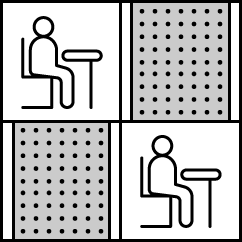
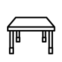
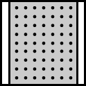

1\.&nbsp;영어 끝말잇기(wordRelay.py)
======
[문제]
------
1부터 n까지 번호가 붙어있는 n명의 사람이 영어 끝말잇기를 하고 있습니다. 영어 끝말잇기는 다음과 같은 규칙으로 진행됩니다.

- 1번부터 번호 순서대로 한 사람씩 차례대로 단어를 말합니다.
- 마지막 사람이 단어를 말한 다음에는 다시 1번부터 시작합니다.
- 앞사람이 말한 단어의 마지막 문자로 시작하는 단어를 말해야 합니다.
- 이전에 등장했던 단어는 사용할 수 없습니다.
- 한 글자인 단어는 인정되지 않습니다.

다음은 3명이 끝말잇기를 하는 상황을 나타냅니다.

tank → kick → know → wheel → land → dream → mother → robot → tank

위 끝말잇기는 다음과 같이 진행됩니다.

- 1번 사람이 자신의 첫 번째 차례에 tank를 말합니다.
- 2번 사람이 자신의 첫 번째 차례에 kick을 말합니다.
- 3번 사람이 자신의 첫 번째 차례에 know를 말합니다.
- 1번 사람이 자신의 두 번째 차례에 wheel을 말합니다.
- (계속 진행)
- 끝말잇기를 계속 진행해 나가다 보면, 3번 사람이 자신의 세 번째 차례에 말한 tank 라는 단어는 이전에 등장했던 단어이므로 탈락하게 됩니다.

사람의 수 n과 사람들이 순서대로 말한 단어 words 가 매개변수로 주어질 때, 가장 먼저 탈락하는 사람의 번호와 그 사람이 자신의 몇 번째 차례에 탈락하는지를 구해서 return 하도록 solution 함수를 완성해주세요.

[제한 사항]
------
- 끝말잇기에 참여하는 사람의 수 n은 2 이상 10 이하의 자연수입니다.
- words는 끝말잇기에 사용한 단어들이 순서대로 들어있는 배열이며, 길이는 n 이상 100 이하입니다.
- 단어의 길이는 2 이상 50 이하입니다.
- 모든 단어는 알파벳 소문자로만 이루어져 있습니다.
- 끝말잇기에 사용되는 단어의 뜻(의미)은 신경 쓰지 않으셔도 됩니다.
- 정답은 [ 번호, 차례 ] 형태로 return 해주세요.
- 만약 주어진 단어들로 탈락자가 생기지 않는다면, [0, 0]을 return 해주세요.

[입출력 예]
------
|n|words|result
|----|----|----|
|3|["tank", "kick", "know", "wheel", "land", "dream", "mother", "robot", "tank"]|[3, 3]
|5|["hello", "observe", "effect", "take", "either", "recognize", "encourage", "ensure", "establish", "hang", "gather", "refer", "reference", "estimate", "executive"]|[0, 0]|
|2|["hello", "one", "even", "never", "now", "world", "draw"]|[1, 3]
 

2\.&nbsp;구명보트(lifeBoat.py)
======
[문제]
------
무인도에 갇힌 사람들을 구명보트를 이용하여 구출하려고 합니다. 구명보트는 작아서 한 번에 최대 2명씩 밖에 탈 수 없고, 무게 제한도 있습니다.

예를 들어, 사람들의 몸무게가 [70kg, 50kg, 80kg, 50kg]이고 구명보트의 무게 제한이 100kg이라면 2번째 사람과 4번째 사람은 같이 탈 수 있지만 1번째 사람과 3번째 사람의 무게의 합은 150kg이므로 구명보트의 무게 제한을 초과하여 같이 탈 수 없습니다.

구명보트를 최대한 적게 사용하여 모든 사람을 구출하려고 합니다.

사람들의 몸무게를 담은 배열 people과 구명보트의 무게 제한 limit가 매개변수로 주어질 때, 모든 사람을 구출하기 위해 필요한 구명보트 개수의 최솟값을 return 하도록 solution 함수를 작성해주세요.

[제한 사항]
------
- 무인도에 갇힌 사람은 1명 이상 50,000명 이하입니다.
- 각 사람의 몸무게는 40kg 이상 240kg 이하입니다.
- 구명보트의 무게 제한은 40kg 이상 240kg 이하입니다.
- 구명보트의 무게 제한은 항상 사람들의 몸무게 중 최댓값보다 크게 주어지므로 사람들을 구출할 수 없는 경우는 없습니다.

[입출력 예]
------
|people|limit|return
|----|----|----|
|[70, 50, 80, 50]|100|3|
|[70, 80, 50]|100|3|
|[50, 50, 50]|100|2|
 

3\.&nbsp;N개의 최소공배수(n-LCMs.py)
======
[문제 설명]
------
두 수의 최소공배수(Least Common Multiple)란 입력된 두 수의 배수 중 공통이 되는 가장 작은 숫자를 의미합니다. 예를 들어 2와 7의 최소공배수는 14가 됩니다. 정의를 확장해서, n개의 수의 최소공배수는 n 개의 수들의 배수 중 공통이 되는 가장 작은 숫자가 됩니다. n개의 숫자를 담은 배열 arr이 입력되었을 때 이 수들의 최소공배수를 반환하는 함수, solution을 완성해 주세요.

[제한 사항]
-----
- arr은 길이 1이상, 15이하인 배열입니다.
- arr의 원소는 100 이하인 자연수입니다.

[입출력 예]
-----
|arr|result|
|---|----|
|[2, 4, 6, 8, 14]|168
|[1, 2, 3]|6|
 

4\.&nbsp;예상 대진표(tournament.py)
======
[문제 설명]
------
△△ 게임대회가 개최되었습니다. 이 대회는 N명이 참가하고, 토너먼트 형식으로 진행됩니다. N명의 참가자는 각각 1부터 N번을 차례대로 배정받습니다. 그리고, 1번↔2번, 3번↔4번, ... , N-1번↔N번의 참가자끼리 게임을 진행합니다. 각 게임에서 이긴 사람은 다음 라운드에 진출할 수 있습니다. 이때, 다음 라운드에 진출할 참가자의 번호는 다시 1번부터 N/2번을 차례대로 배정받습니다. 만약 1번↔2번 끼리 겨루는 게임에서 2번이 승리했다면 다음 라운드에서 1번을 부여받고, 3번↔4번에서 겨루는 게임에서 3번이 승리했다면 다음 라운드에서 2번을 부여받게 됩니다. 게임은 최종 한 명이 남을 때까지 진행됩니다.

이때, 처음 라운드에서 A번을 가진 참가자는 경쟁자로 생각하는 B번 참가자와 몇 번째 라운드에서 만나는지 궁금해졌습니다. 게임 참가자 수 N, 참가자 번호 A, 경쟁자 번호 B가 함수 solution의 매개변수로 주어질 때, 처음 라운드에서 A번을 가진 참가자는 경쟁자로 생각하는 B번 참가자와 몇 번째 라운드에서 만나는지 return 하는 solution 함수를 완성해 주세요. 단, A번 참가자와 B번 참가자는 서로 붙게 되기 전까지 항상 이긴다고 가정합니다.

[제한사항]
-----
- N : 21 이상 220 이하인 자연수 (2의 지수 승으로 주어지므로 부전승은 발생하지 않습니다.)
- A, B : N 이하인 자연수 (단, A ≠ B 입니다.)

[입출력 예]
-----
|N|A|B|answer|
|---|----|----|----|
|8|4|7|3|
 

5\.&nbsp;점프와 순간이동(jumpAndTeleport.py)
======
[문제 설명]
------
OO 연구소는 한 번에 K 칸을 앞으로 점프하거나, (현재까지 온 거리) x 2 에 해당하는 위치로 순간이동을 할 수 있는 특수한 기능을 가진 아이언 슈트를 개발하여 판매하고 있습니다. 이 아이언 슈트는 건전지로 작동되는데, 순간이동을 하면 건전지 사용량이 줄지 않지만, 앞으로 K 칸을 점프하면 K 만큼의 건전지 사용량이 듭니다. 그러므로 아이언 슈트를 착용하고 이동할 때는 순간 이동을 하는 것이 더 효율적입니다. 아이언 슈트 구매자는 아이언 슈트를 착용하고 거리가 N 만큼 떨어져 있는 장소로 가려고 합니다. 단, 건전지 사용량을 줄이기 위해 점프로 이동하는 것은 최소로 하려고 합니다. 아이언 슈트 구매자가 이동하려는 거리 N이 주어졌을 때, 사용해야 하는 건전지 사용량의 최솟값을 return하는 solution 함수를 만들어 주세요.

예를 들어 거리가 5만큼 떨어져 있는 장소로 가려고 합니다.
아이언 슈트를 입고 거리가 5만큼 떨어져 있는 장소로 갈 수 있는 경우의 수는 여러 가지입니다.

- 처음 위치 0 에서 5 칸을 앞으로 점프하면 바로 도착하지만, 건전지 사용량이 5 만큼 듭니다.
- 처음 위치 0 에서 2 칸을 앞으로 점프한 다음 순간이동 하면 (현재까지 온 거리 : 2) x 2에 해당하는 위치로 이동할 수 있으므로 위치 4로 이동합니다. 이때 1 칸을 앞으로 점프하면 도착하므로 건전지 사용량이 3 만큼 듭니다.
- 처음 위치 0 에서 1 칸을 앞으로 점프한 다음 순간이동 하면 (현재까지 온 거리 : 1) x 2에 해당하는 위치로 이동할 수 있으므로 위치 2로 이동됩니다. 이때 다시 순간이동 하면 (현재까지 온 거리 : 2) x 2 만큼 이동할 수 있으므로 위치 4로 이동합니다. 이때 1 칸을 앞으로 점프하면 도착하므로 건전지 사용량이 2 만큼 듭니다.

위의 3가지 경우 거리가 5만큼 떨어져 있는 장소로 가기 위해서 3번째 경우가 건전지 사용량이 가장 적으므로 답은 2가 됩니다.

[제한사항]
-----
- 숫자 N: 1 이상 10억 이하의 자연수
- 숫자 K: 1 이상의 자연수

[입출력 예]
-----
|N|result|
|---|----|
|5|2|
|6|2|
|5000|5|
 

6\.&nbsp;캐시(cache.py)
======
[문제 설명]
------
지도개발팀에서 근무하는 제이지는 지도에서 도시 이름을 검색하면 해당 도시와 관련된 맛집 게시물들을 데이터베이스에서 읽어 보여주는 서비스를 개발하고 있다.
이 프로그램의 테스팅 업무를 담당하고 있는 어피치는 서비스를 오픈하기 전 각 로직에 대한 성능 측정을 수행하였는데, 제이지가 작성한 부분 중 데이터베이스에서 게시물을 가져오는 부분의 실행시간이 너무 오래 걸린다는 것을 알게 되었다.
어피치는 제이지에게 해당 로직을 개선하라고 닦달하기 시작하였고, 제이지는 DB 캐시를 적용하여 성능 개선을 시도하고 있지만 캐시 크기를 얼마로 해야 효율적인지 몰라 난감한 상황이다.

어피치에게 시달리는 제이지를 도와, DB 캐시를 적용할 때 캐시 크기에 따른 실행시간 측정 프로그램을 작성하시오.

[입력 형식]
-------
- 캐시 크기(cacheSize)와 도시이름 배열(cities)을 입력받는다.
- cacheSize는 정수이며, 범위는 0 ≦ cacheSize ≦ 30 이다.
- cities는 도시 이름으로 이뤄진 문자열 배열로, 최대 도시 수는 100,000개이다.
- 각 도시 이름은 공백, 숫자, 특수문자 등이 없는 영문자로 구성되며, 대소문자 구분을 하지 않는다. 도시 이름은 최대 20자로 이루어져 있다.

[출력 형식]
-----
- 입력된 도시이름 배열을 순서대로 처리할 때, "총 실행시간"을 출력한다.

[조건]
-----
- 캐시 교체 알고리즘은 `LRU`(Least Recently Used)를 사용한다.
- `cache hit`일 경우 실행시간은 1이다.
- `cache miss`일 경우 실행시간은 5이다.

[입출력 예제]
-----
|캐시크기(cacheSize)	|도시이름(cities)	|실행시간|
|---|---|---|
|3|["Jeju", "Pangyo", "Seoul", "NewYork", "LA", "Jeju", "Pangyo", "Seoul", "NewYork", "LA"]|50|
|3|["Jeju", "Pangyo", "Seoul", "Jeju", "Pangyo", "Seoul", "Jeju", "Pangyo", "Seoul"]|21
|2|["Jeju", "Pangyo", "Seoul", "NewYork", "LA", "SanFrancisco", "Seoul", "Rome", "Paris", "Jeju", "NewYork", "Rome"]|60
5|["Jeju", "Pangyo", "Seoul", "NewYork", "LA", "SanFrancisco", "Seoul", "Rome", "Paris", "Jeju", "NewYork", "Rome"]|52
2|["Jeju", "Pangyo", "NewYork", "newyork"]|16
0|["Jeju", "Pangyo", "Seoul", "NewYork", "LA"]|25

7\.&nbsp;주차 요금 계산(parkingFees.py)
======
[문제 설명]
------
주차장의 요금표와 차량이 들어오고(입차) 나간(출차) 기록이 주어졌을 때, 차량별로 주차 요금을 계산하려고 합니다. 아래는 하나의 예시를 나타냅니다.
- 요금표
  
|기본 시간(분)	|기본 요금(원)	|단위 시간(분)	|단위 요금(원)
|---|---|---|---|
180|	5000|	10|	600
 

- 입/출차 기록
  
|시각(시:분)|	차량 번호	|내역
|---|---|---|
05:34	|5961|	입차
06:00	|0000|	입차
06:34	|0000|	출차
07:59	|5961|	출차
07:59	|0148|	입차
18:59	|0000|	입차
19:09	|0148|	출차
22:59	|5961|	입차
23:00	|5961|	출차
 

- 자동차별 주차 요금

차량 번호|	누적 주차 시간(분)|	주차 요금(원)
|---|---|---
0000	|34 + 300 = 334	|5000 + ⌈(334 - 180) / 10⌉ x 600 = 14600
0148	|670	|5000 +⌈(670 - 180) / 10⌉x 600 = 34400
5961	|145 + 1 = 146|	5000

- 어떤 차량이 입차된 후에 출차된 내역이 없다면, `23:59`에 출차된 것으로 간주합니다.
`0000`번 차량은 `18:59`에 입차된 이후, 출차된 내역이 없습니다. 따라서, `23:59`에 출차된 것으로 간주합니다.
- `00:00`부터 `23:59`까지의 입/출차 내역을 바탕으로 차량별 누적 주차 시간을 계산하여 요금을 일괄로 정산합니다.
- 누적 주차 시간이 기본 시간이하라면, 기본 요금을 청구합니다.
- 누적 주차 시간이 기본 시간을 초과하면, 기본 요금에 더해서, 초과한 시간에 대해서 단위 시간 마다 단위 요금을 청구합니다.
- 초과한 시간이 단위 시간으로 나누어 떨어지지 않으면, 올림합니다.
`⌈a⌉` : a보다 작지 않은 최소의 정수를 의미합니다. 즉, 올림을 의미합니다.

주차 요금을 나타내는 정수 배열 `fees`, 자동차의 입/출차 내역을 나타내는 문자열 배열 `records`가 매개변수로 주어집니다. **차량 번호가 작은 자동차부터** 청구할 주차 요금을 차례대로 정수 배열에 담아서 return 하도록 solution 함수를 완성해주세요.

[제한 사항]
-------
- fees의 길이 = 4
	- fees[0] = `기본 시간(분)`
	- 1 ≤ fees[0] ≤ 1,439
	- fees[1] = `기본 요금(원)`
	- 0 ≤ fees[1] ≤ 100,000
	- fees[2] = `단위 시간(분)`
	- 1 ≤ fees[2] ≤ 1,439
	- fees[3] = `단위 요금(원)`
	- 1 ≤ fees[3] ≤ 10,000
  
- 1 ≤ records의 길이 ≤ 1,000

	- records의 각 원소는 `"시각 차량번호 내역"` 형식의 문자열입니다.
	- 시각, 차량번호, 내역은 하나의 공백으로 구분되어 있습니다.
	- 시각은 차량이 입차되거나 출차된 시각을 나타내며, HH:MM 형식의 길이 5인 문자열입니다.
	- HH:MM은 00:00부터 23:59까지 주어집니다.
	- 잘못된 시각("25:22", "09:65" 등)은 입력으로 주어지지 않습니다.
	- 차량번호는 자동차를 구분하기 위한, `'0'~'9'`로 구성된 길이 4인 문자열입니다.
	- 내역은 길이 2 또는 3인 문자열로, `IN` 또는 `OUT`입니다. `IN`은 입차를, `OUT`은 출차를 의미합니다.
	- records의 원소들은 시각을 기준으로 오름차순으로 정렬되어 주어집니다.
	- records는 하루 동안의 입/출차된 기록만 담고 있으며, 입차된 차량이 다음날 출차되는 경우는 입력으로 주어지지 않습니다.
	- 같은 시각에, 같은 차량번호의 내역이 2번 이상 나타내지 않습니다.
	- 마지막 시각(23:59)에 입차되는 경우는 입력으로 주어지지 않습니다.
	- 아래의 예를 포함하여, 잘못된 입력은 주어지지 않습니다.
		- 주차장에 없는 차량이 출차되는 경우
		- 주차장에 이미 있는 차량(차량번호가 같은 차량)이 다시 입차되는 경우

[입출력 예]
-----

fees|	records	|result|
|---|---|---
[180, 5000, 10, 600]|	["05:34 5961 IN", "06:00 0000 IN", "06:34 0000 OUT", "07:59 5961 OUT", "07:59 0148 IN", "18:59 0000 IN", "19:09 0148 OUT", "22:59 5961 IN", "23:00 5961 OUT"]	|[14600, 34400, 5000]
[120, 0, 60, 591]|	["16:00 3961 IN","16:00 0202 IN","18:00 3961 OUT","18:00 0202 OUT","23:58 3961 IN"]|	[0, 591]
[1, 461, 1, 10]	|["00:00 1234 IN"]	|[14841]

[입출력 예 설명]
------
**입출력 예 #1**

문제 예시와 같습니다.

**입출력 예 #2**

- 요금표
  
|기본 시간(분)|	기본 요금(원)|	단위 시간(분)|	단위 요금(원)
|---|---|---|---
120	|0|60	|591
 

- 입/출차 기록

시각(시:분)	|차량 번호|	내역
|---|---|---
16:00	|3961|	입차
16:00	|0202|	입차
18:00	|3961|	출차
18:00	|0202|  출차
23:58	|3961|	입차
 

- 자동차별 주차 요금

차량 번호	|누적 주차 시간(분)|	주차 요금(원)
|---|---|---|
0202|	120	|0
3961|	120 + 1 = 121|	0 +⌈(121 - 120) / 60⌉x 591 = 591
	3961번 차량은 2번째 입차된 후에는 출차된 내역이 없으므로, 23:59에 출차되었다고 간주합니다.
 

**입출력 예 #3**

- 요금표

기본 시간(분)|	기본 요금(원)|	단위 시간(분)	|단위 요금(원)
|---|---|---|---
1	|461	|1	|10
 

- 입/출차 기록

시각(시:분)	|차량 번호	|내역
|---|---|---
00:00	|1234	|입차
 

- 자동차별 주차 요금

차량 번호|	누적 주차 시간(분)|	주차 요금(원)
|---|---|---
1234	|1439	|461 +⌈(1439 - 1) / 1⌉x 10 = 14841
	1234번 차량은 출차 내역이 없으므로, 23:59에 출차되었다고 간주합니다.

[제한시간 안내]
-----
정확성 테스트 : 10초

8\.&nbsp;양궁대회(archeryContest.py)
======
[문제 설명]
------

카카오배 양궁대회가 열렸습니다.
`라이언`은 저번 카카오배 양궁대회 우승자이고 이번 대회에도 결승전까지 올라왔습니다. 결승전 상대는 `어피치`입니다.
카카오배 양궁대회 운영위원회는 한 선수의 연속 우승보다는 다양한 선수들이 양궁대회에서 우승하기를 원합니다. 따라서, 양궁대회 운영위원회는 결승전 규칙을 전 대회 우승자인 라이언에게 불리하게 다음과 같이 정했습니다.

1. 어피치가 화살 n발을 다 쏜 후에 라이언이 화살 n발을 쏩니다.
2. 점수를 계산합니다.
	1. 과녁판은 아래 사진처럼 생겼으며 가장 작은 원의 과녁 점수는 10점이고 가장 큰 원의 바깥쪽은 과녁 점수가 0점입니다.
      
   2. 만약, k(k는 1~10사이의 자연수)점을 어피치가 a발을 맞혔고 라이언이 b발을 맞혔을 경우 더 많은 화살을 k점에 맞힌 선수가 k 점을 가져갑니다. 단, a = b일 경우는 어피치가 k점을 가져갑니다. k점을 여러 발 맞혀도 k점 보다 많은 점수를 가져가는 게 아니고 k점만 가져가는 것을 유의하세요. 또한 a = b = 0 인 경우, 즉, 라이언과 어피치 모두 k점에 단 하나의 화살도 맞히지 못한 경우는 어느 누구도 k점을 가져가지 않습니다.
      - 예를 들어, 어피치가 10점을 2발 맞혔고 라이언도 10점을 2발 맞혔을 경우 어피치가 10점을 가져갑니다.
	  - 다른 예로, 어피치가 10점을 0발 맞혔고 라이언이 10점을 2발 맞혔을 경우 라이언이 10점을 가져갑니다.
    3. 모든 과녁 점수에 대하여 각 선수의 최종 점수를 계산합니다.
      
3. 최종 점수가 더 높은 선수를 우승자로 결정합니다. 단, 최종 점수가 같을 경우 어피치를 우승자로 결정합니다.

현재 상황은 어피치가 화살 `n`발을 다 쏜 후이고 라이언이 화살을 쏠 차례입니다.
라이언은 어피치를 가장 큰 점수 차이로 이기기 위해서 n발의 화살을 어떤 과녁 점수에 맞혀야 하는지를 구하려고 합니다.

화살의 개수를 담은 자연수 `n`, 어피치가 맞힌 과녁 점수의 개수를 10점부터 0점까지 순서대로 담은 정수 배열 `info`가 매개변수로 주어집니다. 이때, 라이언이 가장 큰 점수 차이로 우승하기 위해 n발의 화살을 어떤 과녁 점수에 맞혀야 하는지를 10점부터 0점까지 순서대로 정수 배열에 담아 return 하도록 solution 함수를 완성해 주세요. 만약, 라이언이 우승할 수 없는 경우(무조건 지거나 비기는 경우)는 `[-1]`을 return 해주세요.	  

[제한 사항]
-------
- `1` ≤ `n` ≤ `10`
- `info`의 길이 = `11`
	- `0` ≤ info의 원소 ≤ `n`
	- `info`의 원소 총합 = `n`
	- `info`의 i번째 원소는 과녁의 `10 - i` 점을 맞힌 화살 개수입니다. (`i`는 0\~10 사이의 정수입니다.)
- 라이언이 우승할 방법이 있는 경우, return 할 정수 배열의 길이는 `11`입니다.
	- `0` ≤ return할 정수 배열의 원소 ≤ `n`
	- return할 정수 배열의 원소 총합 = n (꼭 n발을 다 쏴야 합니다.)
	- return할 정수 배열의 i번째 원소는 과녁의 10 - i 점을 맞힌 화살 개수입니다. ( i는 0~10 사이의 정수입니다.)
	- 라이언이 가장 큰 점수 차이로 우승할 수 있는 방법이 여러 가지 일 경우, 가장 낮은 점수를 더 많이 맞힌 경우를 return 해주세요.
		- 가장 낮은 점수를 맞힌 개수가 같을 경우 계속해서 그다음으로 낮은 점수를 더 많이 맞힌 경우를 return 해주세요.
		- 예를 들어, `[2,3,1,0,0,0,0,1,3,0,0]`과 `[2,1,0,2,0,0,0,2,3,0,0]`를 비교하면 `[2,1,0,2,0,0,0,2,3,0,0]`를 return 해야 합니다.
		- 다른 예로, `[0,0,2,3,4,1,0,0,0,0,0]`과 `[9,0,0,0,0,0,0,0,1,0,0]`를 비교하면`[9,0,0,0,0,0,0,0,1,0,0]`를 return 해야 합니다.
- 라이언이 우승할 방법이 없는 경우, return 할 정수 배열의 길이는 `1`입니다.
	- 라이언이 어떻게 화살을 쏘든 라이언의 점수가 어피치의 점수보다 낮거나 같으면 `[-1]`을 return 해야 합니다.

[입출력 예]
-----
n|	info|	result|
|---|---|---
5	|[2,1,1,1,0,0,0,0,0,0,0]|	[0,2,2,0,1,0,0,0,0,0,0]
1	|[1,0,0,0,0,0,0,0,0,0,0]|	[-1]
9	|[0,0,1,2,0,1,1,1,1,1,1]|	[1,1,2,0,1,2,2,0,0,0,0]
10	|[0,0,0,0,0,0,0,0,3,4,3]|	[1,1,1,1,1,1,1,1,0,0,2]

[입출력 예 설명]
-------
**입출력 예 #1**

어피치와 라이언이 아래와 같이 화살을 맞힐 경우,

|과녁 점수	|어피치가 맞힌 화살 개수	|라이언이 맞힌 화살 개수	|결과
|------|---|---|---|
10|	2	|3|	라이언이 10점 획득
9	|1|	2	|라이언이 9점 획득
8	|1|	0	|어피치가 8점 획득
7	|1|	0	|어피치가 7점 획득
6	|0|	0	
5	|0|	0	
4	|0|	0	
3	|0|	0	
2	|0|	0	
1	|0|	0	
0	|0|	0

어피치의 최종 점수는 15점, 라이언의 최종 점수는 19점입니다. 4점 차이로 라이언이 우승합니다.

하지만, 라이언이 아래와 같이 화살을 맞힐 경우 더 큰 점수 차로 우승할 수 있습니다.

과녁 점수	|어피치가 맞힌 화살 개수	|라이언이 맞힌 화살 개수	|결과
|---|---|---|---|
10|	2|	0	|어피치가 10점 획득
9	|1|	2	|라이언이 9점 획득
8	|1|	2	|라이언이 8점 획득
7	|1|	0	|어피치가 7점 획득
6|	0	|1	|라이언이 6점 획득
5|	0	|0	
4|	0	|0	
3|	0|	0	
2|	0|	0	
1|	0|	0	
0|	0|	0	

어피치의 최종 점수는 17점, 라이언의 최종 점수는 23점입니다. 6점 차이로 라이언이 우승합니다.

따라서 `[0,2,2,0,1,0,0,0,0,0,0]`을 return 해야 합니다.

**입출력 예 #2**

라이언이 10점을 맞혀도 어피치가 10점을 가져가게 됩니다.
따라서, 라이언은 우승할 수 없기 때문에 `[-1]`을 return 해야 합니다.

**입출력 예 #3**

어피치와 라이언이 아래와 같이 화살을 맞힐 경우,

과녁 점수|	어피치가 맞힌 화살 개수|	라이언이 맞힌 화살 개수|	결과
|---|---|---|---|
10|	0|	1|	라이언이 10점 획득
9|	0|	1|	라이언이 9점 획득
8|	1|	2|	라이언이 8점 획득
7|	2|	3|	라이언이 7점 획득
6|	0|	0|	
5|	1|	2|	라이언이 5점 획득
4|	1|	0|	어피치가 4점 획득
3|	1|	0|	어피치가 3점 획득
2|	1|	0|	어피치가 2점 획득
1|	1|	0|	어피치가 1점 획득
0|	1|	0|	어피치가 0점 획득

어피치의 최종 점수는 10점, 라이언의 최종 점수는 39점입니다. 29점 차이로 라이언이 우승합니다.

하지만 라이언이 아래와 같이 화살을 맞힐 경우,

과녁 점수	|어피치가 맞힌 화살 개수|	라이언이 맞힌 화살 개수|	결과
|---|---|---|---|
10|	0|	1|	라이언이 10점 획득
9|	0|	1|	라이언이 9점 획득
8|	1|	2|	라이언이 8점 획득
7|	2|	0|	어피치가 7점 획득
6|	0|	1|	라이언이 6점 획득
5|	1|	2|	라이언이 5점 획득
4|	1|	2|	라이언이 4점 획득
3|	1|	0|	어피치가 3점 획득
2|	1|	0|	어피치가 2점 획득
1|	1|	0|	어피치가 1점 획득
0|	1|	0|	어피치가 0점 획득

어피치의 최종 점수는 13점, 라이언의 최종 점수는 42점입니다. 이 경우도 29점 차이로 라이언이 우승합니다.

하지만, 첫 번째 경우와 두 번째 경우를 비교했을 때, 두 번째 경우가 두 경우 중 가장 낮은 점수인 4점을 더 많이 맞혔기 때문에 `[1,1,2,3,0,2,0,0,0,0,0]`이 아닌 `[1,1,2,0,1,2,2,0,0,0,0]`을 return 해야 합니다.

**입출력 예 #4**

가장 큰 점수 차이로 이기는 경우 중에서 가장 낮은 점수를 가장 많이 맞힌, 10~3점을 한 발씩 맞히고 나머지 두 발을 0점에 맞히는 경우인 `[1,1,1,1,1,1,1,1,0,0,2]`를 return 해야 합니다.

[제한시간 안내]
------
정확성 테스트 : 10초

9\.&nbsp;롤케이크 자르기(cakeCutting.py)
=====
[문제 설명]
------
철수는 롤케이크를 두 조각으로 잘라서 동생과 한 조각씩 나눠 먹으려고 합니다. 이 롤케이크에는 여러가지 토핑들이 일렬로 올려져 있습니다. 철수와 동생은 롤케이크를 공평하게 나눠먹으려 하는데, 그들은 롤케이크의 크기보다 롤케이크 위에 올려진 토핑들의 종류에 더 관심이 많습니다. 그래서 잘린 조각들의 크기와 올려진 토핑의 개수에 상관없이 각 조각에 동일한 가짓수의 토핑이 올라가면 공평하게 롤케이크가 나누어진 것으로 생각합니다.

예를 들어, 롤케이크에 4가지 종류의 토핑이 올려져 있다고 합시다. 토핑들을 1, 2, 3, 4와 같이 번호로 표시했을 때, 케이크 위에 토핑들이 [1, 2, 1, 3, 1, 4, 1, 2] 순서로 올려져 있습니다. 만약 세 번째 토핑(1)과 네 번째 토핑(3) 사이를 자르면 롤케이크의 토핑은 [1, 2, 1], [3, 1, 4, 1, 2]로 나뉘게 됩니다. 철수가 [1, 2, 1]이 놓인 조각을, 동생이 [3, 1, 4, 1, 2]가 놓인 조각을 먹게 되면 철수는 두 가지 토핑(1, 2)을 맛볼 수 있지만, 동생은 네 가지 토핑(1, 2, 3, 4)을 맛볼 수 있으므로, 이는 공평하게 나누어진 것이 아닙니다. 만약 롤케이크의 네 번째 토핑(3)과 다섯 번째 토핑(1) 사이를 자르면 [1, 2, 1, 3], [1, 4, 1, 2]로 나뉘게 됩니다. 이 경우 철수는 세 가지 토핑(1, 2, 3)을, 동생도 세 가지 토핑(1, 2, 4)을 맛볼 수 있으므로, 이는 공평하게 나누어진 것입니다. 공평하게 롤케이크를 자르는 방법은 여러가지 일 수 있습니다. 위의 롤케이크를 [1, 2, 1, 3, 1], [4, 1, 2]으로 잘라도 공평하게 나뉩니다. 어떤 경우에는 롤케이크를 공평하게 나누지 못할 수도 있습니다.

롤케이크에 올려진 토핑들의 번호를 저장한 정수 배열 topping이 매개변수로 주어질 때, 롤케이크를 공평하게 자르는 방법의 수를 return 하도록 solution 함수를 완성해주세요.

[제한사항]
------
1 ≤ topping의 길이 ≤ 1,000,000
1 ≤ topping의 원소 ≤ 10,000

[입출력 예]
-----
topping|	result
|--|---|
[1, 2, 1, 3, 1, 4, 1, 2]|	2
[1, 2, 3, 1, 4]	|0

[입출력 예 설명]
-----
**입출력 예 #1**

롤케이크를 [1, 2, 1, 3], [1, 4, 1, 2] 또는 [1, 2, 1, 3, 1], [4, 1, 2]와 같이 자르면 철수와 동생은 각각 세 가지 토핑을 맛볼 수 있습니다. 이 경우 공평하게 롤케이크를 나누는 방법은 위의 두 가지만 존재합니다.

**입출력 예 #2**

롤케이크를 공평하게 나눌 수 없습니다.

10\.&nbsp;거리두기 확인하기(checkDistancing.py)
=====
[문제 설명]
------
개발자를 희망하는 죠르디가 카카오에 면접을 보러 왔습니다.

코로나 바이러스 감염 예방을 위해 응시자들은 거리를 둬서 대기를 해야하는데 개발 직군 면접인 만큼
아래와 같은 규칙으로 대기실에 거리를 두고 앉도록 안내하고 있습니다.

> 1. 대기실은 5개이며, 각 대기실은 5x5 크기입니다.
> 2. 거리두기를 위하여 응시자들 끼리는 맨해튼 거리<a href="#fn1">1</a>가 2 이하로 앉지 말아 주세요.
> 3. 단 응시자가 앉아있는 자리 사이가 파티션으로 막혀 있을 경우에는 허용합니다.

예를 들어,
||
|---|---|---|
위 그림처럼 자리 사이에 파티션이 존재한다면 맨해튼 거리가 2여도 거리두기를 지킨 것입니다.|위 그림처럼 파티션을 사이에 두고 앉은 경우도 거리두기를 지킨 것입니다.|위 그림처럼 자리 사이가 맨해튼 거리 2이고 사이에 빈 테이블이 있는 경우는 거리두기를 지키지 않은 것입니다.
||
응시자가 앉아있는 자리(P)를 의미합니다.|빈 테이블(O)을 의미합니다.|파티션(X)을 의미합니다.

5개의 대기실을 본 죠르디는 각 대기실에서 응시자들이 거리두기를 잘 기키고 있는지 알고 싶어졌습니다. 자리에 앉아있는 응시자들의 정보와 대기실 구조를 대기실별로 담은 2차원 문자열 배열 `places`가 매개변수로 주어집니다. 각 대기실별로 거리두기를 지키고 있으면 1을, 한 명이라도 지키지 않고 있으면 0을 배열에 담아 return 하도록 solution 함수를 완성해 주세요.

[제한사항]
------
- `places`의 행 길이(대기실 개수) = 5
	- `places`의 각 행은 하나의 대기실 구조를 나타냅니다.
- `places`의 열 길이(대기실 세로 길이) = 5
- `places`의 원소는 `P`,`O`,`X`로 이루어진 문자열입니다.
	- `places` 원소의 길이(대기실 가로 길이) = 5
	- `P`는 응시자가 앉아있는 자리를 의미합니다.
	- `O`는 빈 테이블을 의미합니다.
	- `X`는 파티션을 의미합니다.
- 입력으로 주어지는 5개 대기실의 크기는 모두 5x5 입니다.
- return 값 형식
	- 1차원 정수 배열에 5개의 원소를 담아서 return 합니다.
	- `places`에 담겨 있는 5개 대기실의 순서대로, 거리두기 준수 여부를 차례대로 배열에 담습니다.
	- 각 대기실 별로 모든 응시자가 거리두기를 지키고 있으면 1을, 한 명이라도 지키지 않고 있으면 0을 담습니다.

[입출력 예]
-----
places	result
[["POOOP", "OXXOX", "OPXPX", "OOXOX", "POXXP"], ["POOPX", "OXPXP", "PXXXO", "OXXXO", "OOOPP"], ["PXOPX", "OXOXP", "OXPOX", "OXXOP", "PXPOX"], ["OOOXX", "XOOOX", "OOOXX", "OXOOX", "OOOOO"], ["PXPXP", "XPXPX", "PXPXP", "XPXPX", "PXPXP"]]	[1, 0, 1, 1, 1]
places|	result
|--|---|
[["POOOP", "OXXOX", "OPXPX", "OOXOX", "POXXP"], ["POOPX", "OXPXP", "PXXXO", "OXXXO", "OOOPP"], ["PXOPX", "OXOXP", "OXPOX", "OXXOP", "PXPOX"], ["OOOXX", "XOOOX", "OOOXX", "OXOOX", "OOOOO"], ["PXPXP", "XPXPX", "PXPXP", "XPXPX", "PXPXP"]]|	[1, 0, 1, 1, 1]

[입출력 예 설명]
-----
**입출력 예 #1**

첫 번째 대기실

No.|0|1|2|3|4
|--|--|--|--|--|--
0|	P|	O|	O|	O|	P|
1|	O|	X|	X|	O|	X|
2|	O|	P|	X|	P|	X|
3|	O|	O|	X|	O|	X|
4|	P|	O|	X|	X|	P|

- 모든 응시자가 거리두기를 지키고 있습니다.

두 번째 대기실

No.|0|1|2|3|4
|--|--|--|--|--|--
0|  P|	O|	O|	P|	X|
1|	O|	X|	P|	X|	P|
2|	P|	X|	X|	X|	O|
3|	O|	X|	X|	X|	O|
4|	O|	O|	O|	P|	P|

- (0, 0) 자리의 응시자와 (2, 0) 자리의 응시자가 거리두기를 지키고 있지 않습니다.
- (1, 2) 자리의 응시자와 (0, 3) 자리의 응시자가 거리두기를 지키고 있지 않습니다.
- (4, 3) 자리의 응시자와 (4, 4) 자리의 응시자가 거리두기를 지키고 있지 않습니다.

세 번째 대기실
No.|0|1|2|3|4
|--|--|--|--|--|--
0|	P|	X|	O|	P|	X|
1|	O|	X|	O|	X|	P|
2|	O|	X|	P|	O|	X|
3|	O|	X|	X|	O|	P|
4|	P|	X|	P|	O|	X|

- 모든 응시자가 거리두기를 지키고 있습니다.

네 번째 대기실
No.|0|1|2|3|4
|--|--|--|--|--|--
0|	O|	O|	O|	X|	X|
1|	X|	O|	O|	O|	X|
2|	O|	O|	O|	X|	X|
3|	O|	X|	O|	O|	X|
4|	O|	O|	O|	O|	O|

- 대기실에 응시자가 없으므로 거리두기를 지키고 있습니다.

다섯 번째 대기실
No.|0|1|2|3|4
|--|--|--|--|--|--
0|	P|	X|	P|	X|	P|
1|	X|	P|	X|	P|	X|
2|	P|	X|	P|	X|	P|
3|	X|	P|	X|	P|	X|
4|	P|	X|	P|	X|	P|

- 모든 응시자가 거리두기를 지키고 있습니다.
  
두 번째 대기실을 제외한 모든 대기실에서 거리두기가 지켜지고 있으므로, 배열 [1, 0, 1, 1, 1]을 return 합니다.

[제한시간 안내]
-----
- 정확성 테스트 : 10초

두 테이블 T1, T2가 행렬 (r1, c1), (r2, c2)에 각각 위치하고 있다면, T1, T2 사이의 맨해튼 거리는 |r1 - r2| + |c1 - c2| 입니다.&nbsp;<a href="#fnref1">&#8617;</a>

11\.&nbsp;멀쩡한 사각형(legitSquare.py)
=====
[문제 설명]
------
가로 길이가 `W`cm, 세로 길이가 `H`cm인 직사각형 종이가 있습니다. 종이에는 가로, 세로 방향과 평행하게 격자 형태로 선이 그어져 있으며, 모든 격자칸은 1cm x 1cm 크기입니다. 이 종이를 격자 선을 따라 1cm × 1cm의 정사각형으로 잘라 사용할 예정이었는데, 누군가가 이 종이를 대각선 꼭지점 2개를 잇는 방향으로 잘라 놓았습니다. 그러므로 현재 직사각형 종이는 크기가 같은 직각삼각형 2개로 나누어진 상태입니다. 새로운 종이를 구할 수 없는 상태이기 때문에, 이 종이에서 원래 종이의 가로, 세로 방향과 평행하게 1cm × 1cm로 잘라 사용할 수 있는 만큼만 사용하기로 하였습니다.
가로의 길이 `W`와 세로의 길이 `H`가 주어질 때, 사용할 수 있는 정사각형의 개수를 구하는 solution 함수를 완성해 주세요.

[제한사항]
------
- `W`, `H` : 1억 이하의 자연수

[입출력 예]
-----

W|	H|	result
|--|--|--
8	|12	|80

[입출력 예 설명]
-----
**입출력 예 #1**

가로가 8, 세로가 12인 직사각형을 대각선 방향으로 자르면 총 16개 정사각형을 사용할 수 없게 됩니다. 원래 직사각형에서는 96개의 정사각형을 만들 수 있었으므로, 96 - 16 = 80 을 반환합니다.

12\.&nbsp;오픈채팅방(openChatRoom.py)
======
[문제 설명]
------
카카오톡 오픈채팅방에서는 친구가 아닌 사람들과 대화를 할 수 있는데, 본래 닉네임이 아닌 가상의 닉네임을 사용하여 채팅방에 들어갈 수 있다.

신입사원인 김크루는 카카오톡 오픈 채팅방을 개설한 사람을 위해, 다양한 사람들이 들어오고, 나가는 것을 지켜볼 수 있는 관리자창을 만들기로 했다. 채팅방에 누군가 들어오면 다음 메시지가 출력된다.

"[닉네임]님이 들어왔습니다."

채팅방에서 누군가 나가면 다음 메시지가 출력된다.

"[닉네임]님이 나갔습니다."

채팅방에서 닉네임을 변경하는 방법은 다음과 같이 두 가지이다.

채팅방을 나간 후, 새로운 닉네임으로 다시 들어간다.
채팅방에서 닉네임을 변경한다.
닉네임을 변경할 때는 기존에 채팅방에 출력되어 있던 메시지의 닉네임도 전부 변경된다.

예를 들어, 채팅방에 "Muzi"와 "Prodo"라는 닉네임을 사용하는 사람이 순서대로 들어오면 채팅방에는 다음과 같이 메시지가 출력된다.

"Muzi님이 들어왔습니다." 
"Prodo님이 들어왔습니다." 

채팅방에 있던 사람이 나가면 채팅방에는 다음과 같이 메시지가 남는다.

"Muzi님이 들어왔습니다." 
"Prodo님이 들어왔습니다." 
"Muzi님이 나갔습니다." 

Muzi가 나간후 다시 들어올 때, Prodo 라는 닉네임으로 들어올 경우 기존에 채팅방에 남아있던 Muzi도 Prodo로 다음과 같이 변경된다.

"Prodo님이 들어왔습니다." 
"Prodo님이 들어왔습니다." 
"Prodo님이 나갔습니다." 
"Prodo님이 들어왔습니다." 

채팅방은 중복 닉네임을 허용하기 때문에, 현재 채팅방에는 Prodo라는 닉네임을 사용하는 사람이 두 명이 있다. 이제, 채팅방에 두 번째로 들어왔던 Prodo가 Ryan으로 닉네임을 변경하면 채팅방 메시지는 다음과 같이 변경된다.

"Prodo님이 들어왔습니다." 
"Ryan님이 들어왔습니다." 
"Prodo님이 나갔습니다." 
"Prodo님이 들어왔습니다." 

채팅방에 들어오고 나가거나, 닉네임을 변경한 기록이 담긴 문자열 배열 `record`가 매개변수로 주어질 때, 모든 기록이 처리된 후, 최종적으로 방을 개설한 사람이 보게 되는 메시지를 문자열 배열 형태로 return 하도록 solution 함수를 완성하라.

[제한 사항]
------
- record는 다음과 같은 문자열이 담긴 배열이며, 길이는 `1` 이상 `100,000` 이하이다.
- 다음은 record에 담긴 문자열에 대한 설명이다.
	- 모든 유저는 [유저 아이디]로 구분한다.
	- [유저 아이디] 사용자가 [닉네임]으로 채팅방에 입장 - "Enter [유저 아이디] [닉네임]" (ex. "Enter uid1234 Muzi")
	- [유저 아이디] 사용자가 채팅방에서 퇴장 - "Leave [유저 아이디]" (ex. "Leave uid1234")
	- [유저 아이디] 사용자가 닉네임을 [닉네임]으로 변경 - "Change [유저 아이디] [닉네임]" (ex. "Change uid1234 Muzi")
	- 첫 단어는 `Enter`, `Leave`, `Change` 중 하나이다.
	- 각 단어는 공백으로 구분되어 있으며, 알파벳 대문자, 소문자, 숫자로만 이루어져있다.
	- 유저 아이디와 닉네임은 알파벳 대문자, 소문자를 구별한다.
	- 유저 아이디와 닉네임의 길이는 `1` 이상 `10` 이하이다.
	- 채팅방에서 나간 유저가 닉네임을 변경하는 등 잘못 된 입력은 주어지지 않는다.

[입출력 예]
-----

|record	|result|
|---|---|
["Enter uid1234 Muzi", "Enter uid4567 Prodo","Leave uid1234","Enter uid1234 Prodo","Change uid4567 Ryan"]	|["Prodo님이 들어왔습니다.", "Ryan님이 들어왔습니다.", "Prodo님이 나갔습니다.", "Prodo님이 들어왔습니다."]|

[입출력 예 설명]
-----
**입출력 예 #1**
 문제의 설명과 같다.

13\.&nbsp;메뉴 리뉴얼(menuRenewal.py)
======
[문제 설명]
------
레스토랑을 운영하던 `스카피`는 코로나19로 인한 불경기를 극복하고자 메뉴를 새로 구성하려고 고민하고 있습니다.
기존에는 단품으로만 제공하던 메뉴를 조합해서 코스요리 형태로 재구성해서 새로운 메뉴를 제공하기로 결정했습니다. 어떤 단품메뉴들을 조합해서 코스요리 메뉴로 구성하면 좋을 지 고민하던 "스카피"는 이전에 각 손님들이 주문할 때 가장 많이 함께 주문한 단품메뉴들을 코스요리 메뉴로 구성하기로 했습니다.
단, 코스요리 메뉴는 최소 2가지 이상의 단품메뉴로 구성하려고 합니다. 또한, 최소 2명 이상의 손님으로부터 주문된 단품메뉴 조합에 대해서만 코스요리 메뉴 후보에 포함하기로 했습니다.

예를 들어, 손님 6명이 주문한 단품메뉴들의 조합이 다음과 같다면,
(각 손님은 단품메뉴를 2개 이상 주문해야 하며, 각 단품메뉴는 A ~ Z의 알파벳 대문자로 표기합니다.)

손님 번호	|주문한 단품메뉴 조합
|-----|----|
1번 손님	|A, B, C, F, G
2번 손님	|A, C
3번 손님	|C, D, E
4번 손님	|A, C, D, E
5번 손님	|B, C, F, G
6번 손님	|A, C, D, E, H

가장 많이 함께 주문된 단품메뉴 조합에 따라 "스카피"가 만들게 될 코스요리 메뉴 구성 후보는 다음과 같습니다.

코스 종류	|메뉴 구성	|설명
|---|---|---
요리 2개 코스	|A, C	|1번, 2번, 4번, 6번 손님으로부터 총 4번 주문됐습니다.
요리 3개 코스	|C, D, E	|3번, 4번, 6번 손님으로부터 총 3번 주문됐습니다.
요리 4개 코스	|B, C, F, G	|1번, 5번 손님으로부터 총 2번 주문됐습니다.
요리 4개 코스	|A, C, D, E	|4번, 6번 손님으로부터 총 2번 주문됐습니다.

[문제]
------
각 손님들이 주문한 단품메뉴들이 문자열 형식으로 담긴 배열 orders, "스카피"가 `추가하고 싶어하는` 코스요리를 구성하는 단품메뉴들의 갯수가 담긴 배열 course가 매개변수로 주어질 때, "스카피"가 새로 추가하게 될 코스요리의 메뉴 구성을 문자열 형태로 배열에 담아 return 하도록 solution 함수를 완성해 주세요.

[제한 사항]
------
- orders 배열의 크기는 2 이상 20 이하입니다.
- orders 배열의 각 원소는 크기가 2 이상 10 이하인 문자열입니다.
	- 각 문자열은 알파벳 대문자로만 이루어져 있습니다.
	- 각 문자열에는 같은 알파벳이 중복해서 들어있지 않습니다.
- course 배열의 크기는 1 이상 10 이하입니다.
	- course 배열의 각 원소는 2 이상 10 이하인 자연수가 `오름차순`으로 정렬되어 있습니다.
	- course 배열에는 같은 값이 중복해서 들어있지 않습니다.
- 정답은 각 코스요리 메뉴의 구성을 문자열 형식으로 배열에 담아 사전 순으로 `오름차순` 정렬해서 return 해주세요.
	- 배열의 각 원소에 저장된 문자열 또한 알파벳 `오름차순`으로 정렬되어야 합니다.
	- 만약 가장 많이 함께 주문된 메뉴 구성이 여러 개라면, 모두 배열에 담아 return 하면 됩니다.
	- orders와 course 매개변수는 return 하는 배열의 길이가 1 이상이 되도록 주어집니다.

[입출력 예]
-----

orders	|course|	result
|---|---|---
["ABCFG", "AC", "CDE", "ACDE", "BCFG", "ACDEH"]|	[2,3,4]	|["AC", "ACDE", "BCFG", "CDE"]
["ABCDE", "AB", "CD", "ADE", "XYZ", "XYZ", "ACD"]	|[2,3,5]	|["ACD", "AD", "ADE", "CD", "XYZ"]
["XYZ", "XWY", "WXA"]|	[2,3,4]|	["WX", "XY"]

[입출력 예 설명]
-----
**입출력 예 #1** 
문제의 예시와 같습니다.

**입출력 예 #2** 
AD가 세 번, CD가 세 번, ACD가 두 번, ADE가 두 번, XYZ 가 두 번 주문됐습니다. 
요리 5개를 주문한 손님이 1명 있지만, 최소 2명 이상의 손님에게서 주문된 구성만 코스요리 후보에 들어가므로, 요리 5개로 구성된 코스요리는 새로 추가하지 않습니다.

**입출력 예 #3** 
WX가 두 번, XY가 두 번 주문됐습니다. 
3명의 손님 모두 단품메뉴를 3개씩 주문했지만, 최소 2명 이상의 손님에게서 주문된 구성만 코스요리 후보에 들어가므로, 요리 3개로 구성된 코스요리는 새로 추가하지 않습니다. 
또, 단품메뉴를 4개 이상 주문한 손님은 없으므로, 요리 4개로 구성된 코스요리 또한 새로 추가하지 않습니다.

14\.&nbsp;택배 배달과 수거(shipping.py)
======
[문제]
-----

당신은 일렬로 나열된 `n`개의 집에 택배를 배달하려 합니다. 배달할 물건은 모두 크기가 같은 재활용 택배 상자에 담아 배달하며, 배달을 다니면서 빈 재활용 택배 상자들을 수거하려 합니다.
배달할 택배들은 모두 재활용 택배 상자에 담겨서 물류창고에 보관되어 있고, `i`번째 집은 물류창고에서 거리 i만큼 떨어져 있습니다. 또한 `i`번째 집은 `j`번째 집과 거리 `j - i`만큼 떨어져 있습니다. (1 ≤ `i` ≤ `j` ≤ `n`)
트럭에는 재활용 택배 상자를 최대 `cap`개 실을 수 있습니다. 트럭은 배달할 재활용 택배 상자들을 실어 물류창고에서 출발해 각 집에 배달하면서, 빈 재활용 택배 상자들을 수거해 물류창고에 내립니다. 각 집마다 배달할 재활용 택배 상자의 개수와 수거할 빈 재활용 택배 상자의 개수를 알고 있을 때, 트럭 하나로 모든 배달과 수거를 마치고 물류창고까지 돌아올 수 있는 최소 이동 거리를 구하려 합니다. 각 집에 배달 및 수거할 때, 원하는 개수만큼 택배를 배달 및 수거할 수 있습니다.

다음은 `cap`=4 일 때, 최소 거리로 이동하면서 5개의 집에 배달 및 수거하는 과정을 나타낸 예시입니다.

**배달 및 수거할 재활용 택배 상자 개수**

||	집 #1|	집 #2	|집 #3	|집 #4	|집 #5
 |---|---|---|---|---|---|
|배달|	1개	|0개	|3개	|1개	|2개
|수거|	0개	|3개	|0개	|4개	|0개

**배달 및 수거 과정**
|	|집 #1|	집 #2|	집 #3|	집 #4|	집 #5|	설명|
|---|---|---|---|---|---|---
남은 배달/수거|	1/0|	0/3|	3/0|	1/4|	2/0|	물류창고에서 택배 3개를 트럭에 실어 출발합니다.
남은 배달/수거|	1/0|	0/3|	3/0|	0/4|	0/0|	물류창고에서 5번째 집까지 이동하면서(거리 5) 4번째 집에 택배 1개를 배달하고, 5번째 집에 택배 2개를 배달합니다.
남은 배달/수거|	1/0|	0/3|	3/0|	0/0|	0/0|	5번째 집에서 물류창고까지 이동하면서(거리 5) 4번째 집에서 빈 택배 상자 4개를 수거한 후, 수거한 빈 택배 상자를 물류창고에 내리고 택배 4개를 트럭에 싣습니다.
남은 배달/수거|	0/0	|0/3	|0/0	|0/0	|0/0	|물류창고에서 3번째 집까지 이동하면서(거리 3) 1번째 집에 택배 1개를 배달하고, 3번째 집에 택배 3개를 배달합니다.
남은 배달/수거|	0/0|	0/0|	0/0|	0/0|	0/0|	3번째 집에서 물류창고까지 이동하면서(거리 3) 2번째 집에서 빈 택배 상자 3개를 수거한 후, 수거한 빈 택배 상자를 물류창고에 내립니다.

16(=5+5+3+3)의 거리를 이동하면서 모든 배달 및 수거를 마쳤습니다. 같은 거리로 모든 배달 및 수거를 마치는 다른 방법이 있지만, 이보다 짧은 거리로 모든 배달 및 수거를 마치는 방법은 없습니다.

트럭에 실을 수 있는 재활용 택배 상자의 최대 개수를 나타내는 정수 `cap`, 배달할 집의 개수를 나타내는 정수 `n`, 각 집에 배달할 재활용 택배 상자의 개수를 담은 1차원 정수 배열 `deliveries`와 각 집에서 수거할 빈 재활용 택배 상자의 개수를 담은 1차원 정수 배열 `pickups`가 매개변수로 주어집니다. 이때, 트럭 하나로 모든 배달과 수거를 마치고 물류창고까지 돌아올 수 있는 최소 이동 거리를 return 하도록 solution 함수를 완성해 주세요.

[제한 사항]
------
- 1 ≤ cap ≤ 50
- 1 ≤ n ≤ 100,000
- deliveries의 길이 = pickups의 길이 = n
	- deliveries[i]는 i+1번째 집에 배달할 재활용 택배 상자의 개수를 나타냅니다.
	- pickups[i]는 i+1번째 집에서 수거할 빈 재활용 택배 상자의 개수를 나타냅니다.
	- 0 ≤ deliveries의 원소 ≤ 50
	- 0 ≤ pickups의 원소 ≤ 50
- 트럭의 초기 위치는 물류창고입니다.

[입출력 예]
------
cap	|n|	deliveries|	pickup|	result
|---|--|---|---|---
4	|5|	[1, 0, 3, 1, 2]|	[0, 3, 0, 4, 0]	|16
2	|7|	[1, 0, 2, 0, 1, 0, 2]|	[0, 2, 0, 1, 0, 2, 0]|	30

[입출력 예 설명]
------
**입출력 예 #1**

문제 예시와 동일합니다.

**입출력 예 #2**

**배달 및 수거할 재활용 택배 상자 개수**

||집 #1|	집 #2|	집 #3|	집 #4|	집 #5|	집 #6|	집 #7|
|---|---|---|---|---|---|---|---
배달|	1개|	0개|	2개|	0개|	1개|	0개|	2개
수거|	0개|	2개|	0개|	1개|	0개|	2개|	0개

**배달 및 수거 과정**

||집 #1|	집 #2|	집 #3|	집 #4|	집 #5|	집 #6|	집 #7|	설명
|---|---|---|---|---|---|---|---|---|
남은 배달/수거|	1/0|	0/2|	2/0|	0/1|	1/0|	0/2|	2/0|	물류창고에서 택배 2개를 트럭에 실어 출발합니다.
남은 배달/수거|	1/0|	0/2|	2/0|	0/1|	1/0|	0/2|	0/0|	물류창고에서 7번째 집까지 이동하면서(거리 7) 7번째 집에 택배 2개를 배달합니다.
남은 배달/수거|	1/0|	0/2|	2/0|	0/1|	1/0|	0/0|	0/0|	7번째 집에서 물류창고까지 이동하면서(거리 7) 6번째 집에서 빈 택배 상자 2개를 수거한 후, 수거한 빈 택배 상자를 물류창고에 내리고 택배 2개를 트럭에 싣습니다.
남은 배달/수거|	1/0|	0/2|	1/0|	0/1|	0/0|	0/0|	0/0|	물류창고에서 5번째 집까지 이동하면서(거리 5) 3번째 집에 택배 1개를 배달하고, 5번째 집에 택배 1개를 배달합니다.
남은 배달/수거|	1/0|	0/1|	1/0|	0/0|	0/0|	0/0|	0/0|	5번째 집에서 물류창고까지 이동하면서(거리 5) 4번째 집에서 빈 택배 상자 1개를 수거하고 2번째 집에서 빈 택배 상자 1개를 수거한 후, 수거한 빈 택배 상자를 물류창고에 내리고 택배 2개를 트럭에 싣습니다.
남은 배달/수거|	0/0|	0/1|	0/0|	0/0|	0/0|	0/0|	0/0|	물류창고에서 3번째 집까지 이동하면서(거리 3) 1번째 집에 택배 1개를 배달하고, 3번째 집에 택배 1개를 배달합니다.
남은 배달/수거|	0/0|	0/0|	0/0|	0/0|	0/0|	0/0|	0/0|	3번째 집에서 물류창고까지 이동하면서(거리 3) 2번째 집에서 빈 택배 상자 1개를 수거한 후, 수거한 빈 택배 상자를 물류창고에 내립니다.

30(=7+7+5+5+3+3)의 거리를 이동하면서 모든 배달 및 수거를 마쳤습니다. 같은 거리로 모든 배달 및 수거를 마치는 다른 방법이 있지만, 이보다 짧은 거리로 모든 배달 및 수거를 마치는 방법은 없습니다.

따라서, 30을 return 하면 됩니다.
 