1\.&nbsp;징검다리 건너기(steppingStone.py)
======
[문제]
------
[본 문제는 정확성과 효율성 테스트 각각 점수가 있는 문제입니다.]

카카오 초등학교의 "니니즈 친구들"이 "라이언" 선생님과 함께 가을 소풍을 가는 중에 징검다리가 있는 개울을 만나서 건너편으로 건너려고 합니다. "라이언" 선생님은 "니니즈 친구들"이 무사히 징검다리를 건널 수 있도록 다음과 같이 규칙을 만들었습니다.

- 징검다리는 일렬로 놓여 있고 각 징검다리의 디딤돌에는 모두 숫자가 적혀 있으며 디딤돌의 숫자는 한 번 밟을 때마다 1씩 줄어듭니다.
- 디딤돌의 숫자가 0이 되면 더 이상 밟을 수 없으며 이때는 그 다음 디딤돌로 한번에 여러 칸을 건너 뛸 수 있습니다.
- 단, 다음으로 밟을 수 있는 디딤돌이 여러 개인 경우 무조건 가장 가까운 디딤돌로만 건너뛸 수 있습니다.
- 
"니니즈 친구들"은 개울의 왼쪽에 있으며, 개울의 오른쪽 건너편에 도착해야 징검다리를 건넌 것으로 인정합니다.
"니니즈 친구들"은 한 번에 한 명씩 징검다리를 건너야 하며, 한 친구가 징검다리를 모두 건넌 후에 그 다음 친구가 건너기 시작합니다.

디딤돌에 적힌 숫자가 순서대로 담긴 배열 stones와 한 번에 건너뛸 수 있는 디딤돌의 최대 칸수 k가 매개변수로 주어질 때, 최대 몇 명까지 징검다리를 건널 수 있는지 return 하도록 solution 함수를 완성해주세요.


[제한 사항]
------
- 징검다리를 건너야 하는 니니즈 친구들의 수는 무제한 이라고 간주합니다.
- stones 배열의 크기는 1 이상 200,000 이하입니다.
- stones 배열 각 원소들의 값은 1 이상 200,000,000 이하인 자연수입니다.
- k는 1 이상 stones의 길이 이하인 자연수입니다.


[입출력 예]
------
|stones|k|result
|----|----|----|
|[2, 4, 5, 3, 2, 1, 4, 2, 5, 1]|3|3

[입출력 예에 대한 설명]
------
**입출력 예 #1**

첫 번째 친구는 다음과 같이 징검다리를 건널 수 있습니다.
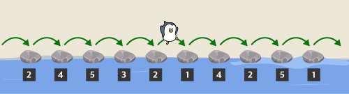
첫 번째 친구가 징검다리를 건넌 후 디딤돌에 적힌 숫자는 아래 그림과 같습니다.<br>
두 번째 친구도 아래 그림과 같이 징검다리를 건널 수 있습니다.
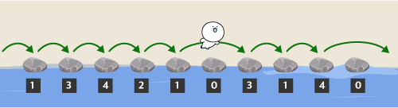
두 번째 친구가 징검다리를 건넌 후 디딤돌에 적힌 숫자는 아래 그림과 같습니다.<br>
세 번째 친구도 아래 그림과 같이 징검다리를 건널 수 있습니다.
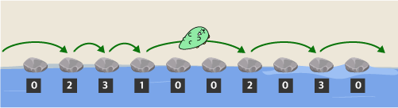
세 번째 친구가 징검다리를 건넌 후 디딤돌에 적힌 숫자는 아래 그림과 같습니다.<br>
네 번째 친구가 징검다리를 건너려면, 세 번째 디딤돌에서 일곱 번째 디딤돌로 네 칸을 건너뛰어야 합니다. 하지만 k = 3 이므로 건너뛸 수 없습니다.
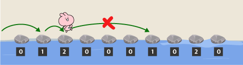
따라서 최대 3명이 디딤돌을 모두 건널 수 있습니다.
<br>

2\.&nbsp;다단계 칫솔판매(salesPyramid.py)
======
[문제]
------
민호는 다단계 조직을 이용하여 칫솔을 판매하고 있습니다. 판매원이 칫솔을 판매하면 그 이익이 피라미드 조직을 타고 조금씩 분배되는 형태의 판매망입니다. 어느정도 판매가 이루어진 후, 조직을 운영하던 민호는 조직 내 누가 얼마만큼의 이득을 가져갔는지가 궁금해졌습니다. 예를 들어, 민호가 운영하고 있는 다단계 칫솔 판매 조직이 아래 그림과 같다고 합시다.
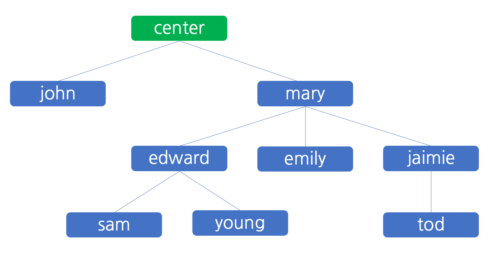
민호는 center이며, 파란색 네모는 여덟 명의 판매원을 표시한 것입니다. 각각은 자신을 조직에 참여시킨 추천인에 연결되어 피라미드 식의 구조를 이루고 있습니다. 조직의 이익 분배 규칙은 간단합니다. 모든 판매원은 칫솔의 판매에 의하여 발생하는 이익에서 10% 를 계산하여 자신을 조직에 참여시킨 추천인에게 배분하고 나머지는 자신이 가집니다. 모든 판매원은 자신이 칫솔 판매에서 발생한 이익 뿐만 아니라, 자신이 조직에 추천하여 가입시킨 판매원에게서 발생하는 이익의 10% 까지 자신에 이익이 됩니다. 자신에게 발생하는 이익 또한 마찬가지의 규칙으로 자신의 추천인에게 분배됩니다. 단, 10% 를 계산할 때에는 원 단위에서 절사하며, 10%를 계산한 금액이 1 원 미만인 경우에는 이득을 분배하지 않고 자신이 모두 가집니다.

예를 들어, 아래와 같은 판매 기록이 있다고 가정하겠습니다. 칫솔의 판매에서 발생하는 이익은 개당 100 원으로 정해져 있습니다.
|판매원	|판매 수량	|이익금
|---|---|---|
young	|12	|1,200 원
john	|4|	400 원
tod	2	|200| 원
emily	|5	|500 원
mary	|10	|1,000 원

판매원 young 에 의하여 1,200 원의 이익이 발생했습니다. young 은 이 중 10% 에 해당하는 120 원을, 자신을 조직에 참여시킨 추천인인 edward 에게 배분하고 자신은 나머지인 1,080 원을 가집니다. edward 는 young 에게서 받은 120 원 중 10% 인 12 원을 mary 에게 배분하고 자신은 나머지인 108 원을 가집니다. 12 원을 edward 로부터 받은 mary 는 10% 인 1 원을 센터에 (즉, 민호에게) 배분하고 자신은 나머지인 11 원을 가집니다. 이 상태를 그림으로 나타내면 아래와 같습니다.
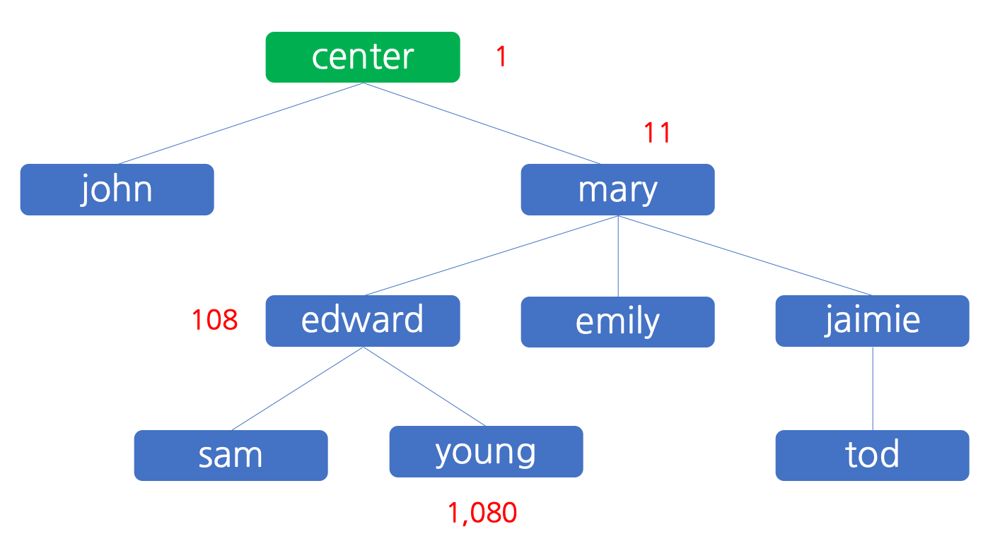
그 후, 판매원 john 에 의하여 400 원의 이익이 발생합니다. john 은 10% 인 40 원을 센터에 배분하고 자신이 나머지인 360 원을 가집니다. 이 상태를 그림으로 나타내면 아래와 같습니다.
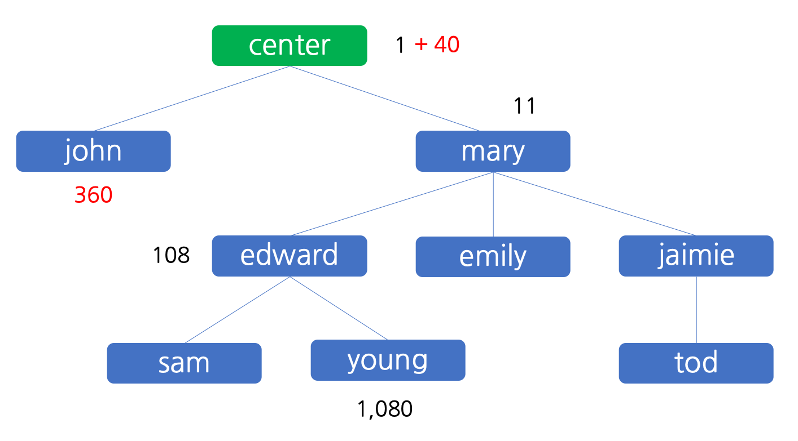
또 그 후에는 판매원 tod 에 의하여 200 원 이익이 발생하는데, tod 자신이 180 원을, 추천인인 jaimie 가 그 중 10% 인 20 원을 받아서 18 원을 가지고, jaimie 의 추천인인 mary 는 2 원을 받지만 이것의 10% 는 원 단위에서 절사하면 배분할 금액이 없기 때문에 mary 는 2 원을 모두 가집니다. 이 상태를 그림으로 나타내면 아래와 같습니다.

그 다음으로 emily 가 칫솔 판매를 통하여 얻은 이익 500 원은 마찬가지의 규칙에 따라 emily 에게 450 원, mary 에게 45 원, 그리고 센터에 5 원으로 분배됩니다. 이 상태를 그림으로 나타내면 아래와 같습니다.
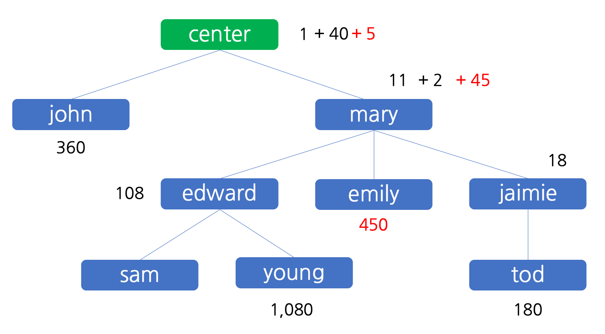
마지막으로, 판매원 mary 는 1,000 원의 이익을 달성하고, 이 중 10% 인 100 원을 센터에 배분한 후 그 나머지인 900 원을 자신이 가집니다. 이 상태를 그림으로 나타내면 아래와 같습니다.
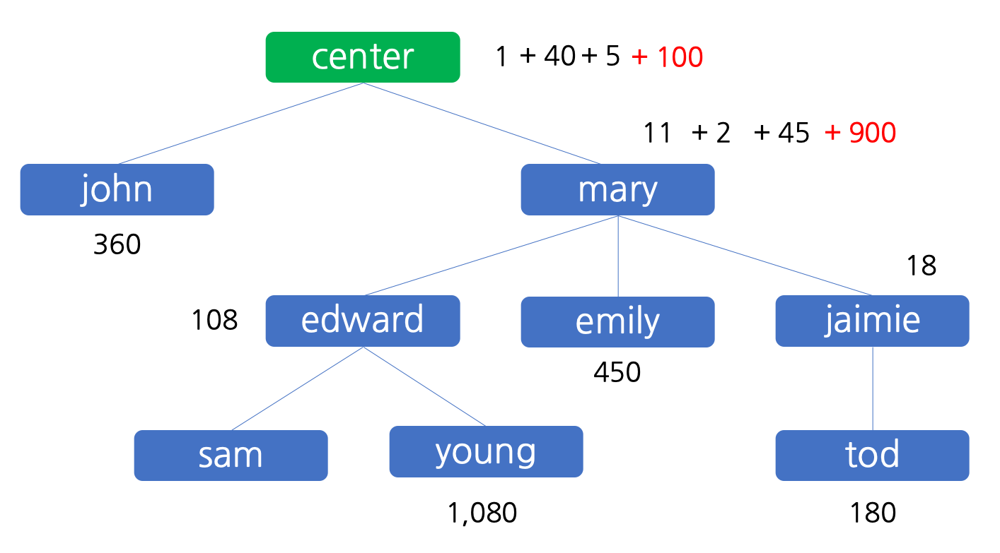
위와 같이 하여 모든 조직 구성원들의 이익 달성 현황 집계가 끝났습니다. 지금까지 얻은 이익을 모두 합한 결과를 그림으로 나타내면 아래와 같습니다.
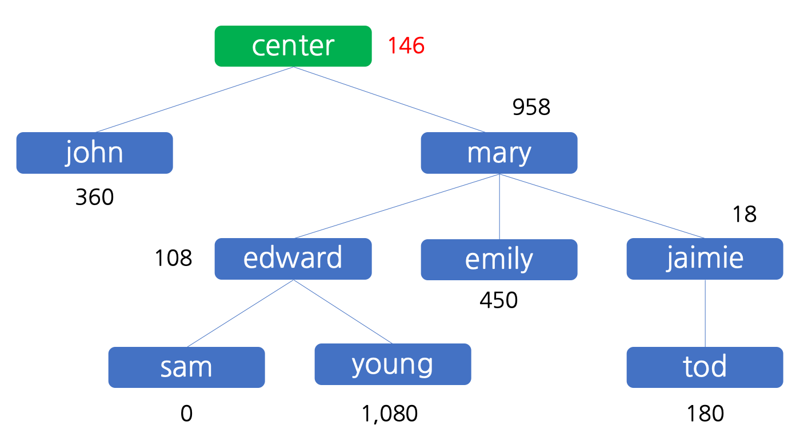
이 결과가 민호가 파악하고자 하는 이익 배분 현황입니다.

각 판매원의 이름을 담은 배열 enroll, 각 판매원을 다단계 조직에 참여시킨 다른 판매원의 이름을 담은 배열 referral, 판매량 집계 데이터의 판매원 이름을 나열한 배열 seller, 판매량 집계 데이터의 판매 수량을 나열한 배열 amount가 매개변수로 주어질 때, 각 판매원이 득한 이익금을 나열한 배열을 return 하도록 solution 함수를 완성해주세요. 판매원에게 배분된 이익금의 총합을 계산하여(정수형으로), 입력으로 주어진 enroll에 이름이 포함된 순서에 따라 나열하면 됩니다.


[제한 사항]
------
- enroll의 길이는 1 이상 10,000 이하입니다.
	- enroll에 민호의 이름은 없습니다. 따라서 enroll의 길이는 민호를 제외한 조직 구성원의 총 수입니다.
- referral의 길이는 enroll의 길이와 같습니다.
	- referral 내에서 i 번째에 있는 이름은 배열 enroll 내에서 i 번째에 있는 판매원을 조직에 참여시킨 사람의 이름입니다.
	- 어느 누구의 추천도 없이 조직에 참여한 사람에 대해서는 referral 배열 내에 추천인의 이름이 기입되지 않고 `“-“` 가 기입됩니다. 위 예제에서는 john 과 mary 가 이러한 예에 해당합니다.
	- enroll 에 등장하는 이름은 조직에 참여한 순서에 따릅니다.
	- 즉, 어느 판매원의 이름이 enroll 의 i 번째에 등장한다면, 이 판매원을 조직에 참여시킨 사람의 이름, 즉 referral 의 i 번째 원소는 이미 배열 enroll 의 j 번째 (j < i) 에 등장했음이 보장됩니다.
- seller의 길이는 1 이상 100,000 이하입니다.
	- seller 내의 i 번째에 있는 이름은 i 번째 판매 집계 데이터가 어느 판매원에 의한 것인지를 나타냅니다.
	- seller 에는 같은 이름이 중복해서 들어있을 수 있습니다.
- amount의 길이는 seller의 길이와 같습니다.
	- amount 내의 i 번째에 있는 수는 i 번째 판매 집계 데이터의 판매량을 나타냅니다.
	- 판매량의 범위, 즉 amount 의 원소들의 범위는 1 이상 100 이하인 자연수입니다.
- 칫솔 한 개를 판매하여 얻어지는 이익은 100 원으로 정해져 있습니다.
- 모든 조직 구성원들의 이름은 10 글자 이내의 영문 알파벳 소문자들로만 이루어져 있습니다.


[입출력 예]
------
enroll|referral|seller|amount|result
|---|---|--|---|---|
["john", "mary", "edward", "sam", "emily", "jaimie", "tod", "young"]	|["-", "-", "mary", "edward", "mary", "mary", "jaimie", "edward"]	|["young", "john", "tod", "emily", "mary"]	|[12, 4, 2, 5, 10]	|[360, 958, 108, 0, 450, 18, 180, 1080]
["john", "mary", "edward", "sam", "emily", "jaimie", "tod", "young"]	|["-", "-", "mary", "edward", "mary", "mary", "jaimie", "edward"]	|["sam", "emily", "jaimie", "edward"]|	[2, 3, 5, 4]|	[0, 110, 378, 180, 270, 450, 0, 0]

[입출력 예에 대한 설명]
------
**입출력 예 #1**

문제의 예시와 같습니다.

**입출력 예 #2**

문제에 주어진 예시와 동일한 조직 구성에 조금 다른 판매량 집계를 적용한 것입니다. 이익을 분배하는 규칙이 동일하므로, 간단한 계산에 의하여 표에 보인 결과를 얻을 수 있습니다.
<br>

3\.&nbsp;보석 쇼핑(gemShopping.py)
======
[문제]
------
**[본 문제는 정확성과 효율성 테스트 각각 점수가 있는 문제입니다.]**

개발자 출신으로 세계 최고의 갑부가 된 `어피치`는 스트레스를 받을 때면 이를 풀기 위해 오프라인 매장에 쇼핑을 하러 가곤 합니다.

어피치는 쇼핑을 할 때면 매장 진열대의 특정 범위의 물건들을 모두 싹쓸이 구매하는 습관이 있습니다.
어느 날 스트레스를 풀기 위해 보석 매장에 쇼핑을 하러 간 어피치는 이전처럼 진열대의 특정 범위의 보석을 모두 구매하되 특별히 아래 목적을 달성하고 싶었습니다.

`진열된 모든 종류의 보석을 적어도 1개 이상 포함하는 가장 짧은 구간을 찾아서 구매`

예를 들어 아래 진열대는 4종류의 보석(RUBY, DIA, EMERALD, SAPPHIRE) 8개가 진열된 예시입니다.

진열대 번호|	1|	2|	3|	4|	5|	6|	7|	8|
|---|---|---|---|---|---|---|---|---|
보석 이름	|DIA|	RUBY|	RUBY|	DIA|	DIA|	EMERALD	|SAPPHIRE|	DIA|

진열대의 3번부터 7번까지 5개의 보석을 구매하면 모든 종류의 보석을 적어도 하나 이상씩 포함하게 됩니다.

진열대의 3, 4, 6, 7번의 보석만 구매하는 것은 중간에 특정 구간(5번)이 빠지게 되므로 어피치의 쇼핑 습관에 맞지 않습니다.

진열대 번호 순서대로 보석들의 이름이 저장된 배열 gems가 매개변수로 주어집니다. 이때 모든 보석을 하나 이상 포함하는 가장 짧은 구간을 찾아서 return 하도록 solution 함수를 완성해주세요.

가장 짧은 구간의 `시작 진열대 번호`와 `끝 진열대 번호`를 차례대로 배열에 담아서 return 하도록 하며, 만약 가장 짧은 구간이 여러 개라면 `시작 진열대 번호`가 가장 작은 구간을 return 합니다.


[제한 사항]
------
- gems 배열의 크기는 1 이상 100,000 이하입니다.
	- gems 배열의 각 원소는 진열대에 나열된 보석을 나타냅니다.
	- gems 배열에는 1번 진열대부터 진열대 번호 순서대로 보석이름이 차례대로 저장되어 있습니다.
	- gems 배열의 각 원소는 길이가 1 이상 10 이하인 알파벳 대문자로만 구성된 문자열입니다.


[입출력 예]
------
|gems|result
|----|----|
["DIA", "RUBY", "RUBY", "DIA", "DIA", "EMERALD", "SAPPHIRE", "DIA"]	|[3, 7]
["AA", "AB", "AC", "AA", "AC"]	|[1, 3]
["XYZ", "XYZ", "XYZ"]	|[1, 1]
["ZZZ", "YYY", "NNNN", "YYY", "BBB"]	|[1, 5]


[입출력 예에 대한 설명]
------

**입출력 예 #1**

문제 예시와 같습니다.

**입출력 예 #2**

3종류의 보석(AA, AB, AC)을 모두 포함하는 가장 짧은 구간은 [1, 3], [2, 4]가 있습니다.
`시작 진열대 번호`가 더 작은 [1, 3]을 return 해주어야 합니다.

**입출력 예 #3**

1종류의 보석(XYZ)을 포함하는 가장 짧은 구간은 [1, 1], [2, 2], [3, 3]이 있습니다.
`시작 진열대 번호`가 가장 작은 [1, 1]을 return 해주어야 합니다.

**입출력 예 #4**

4종류의 보석(ZZZ, YYY, NNNN, BBB)을 모두 포함하는 구간은 [1, 5]가 유일합니다.
그러므로 [1, 5]를 return 해주어야 합니다.
<br>

4\.&nbsp;양과 늑대(sheepAndWolves.py)
======
[문제 설명]
------

 2진 트리 모양 초원의 각 노드에 늑대와 양이 한 마리씩 놓여 있습니다. 이 초원의 루트 노드에서 출발하여 각 노드를 돌아다니며 양을 모으려 합니다. 각 노드를 방문할 때 마다 해당 노드에 있던 양과 늑대가 당신을 따라오게 됩니다. 이때, 늑대는 양을 잡아먹을 기회를 노리고 있으며, 당신이 모은 양의 수보다 늑대의 수가 같거나 더 많아지면 바로 모든 양을 잡아먹어 버립니다. 당신은 중간에 양이 늑대에게 잡아먹히지 않도록 하면서 최대한 많은 수의 양을 모아서 다시 루트 노드로 돌아오려 합니다.

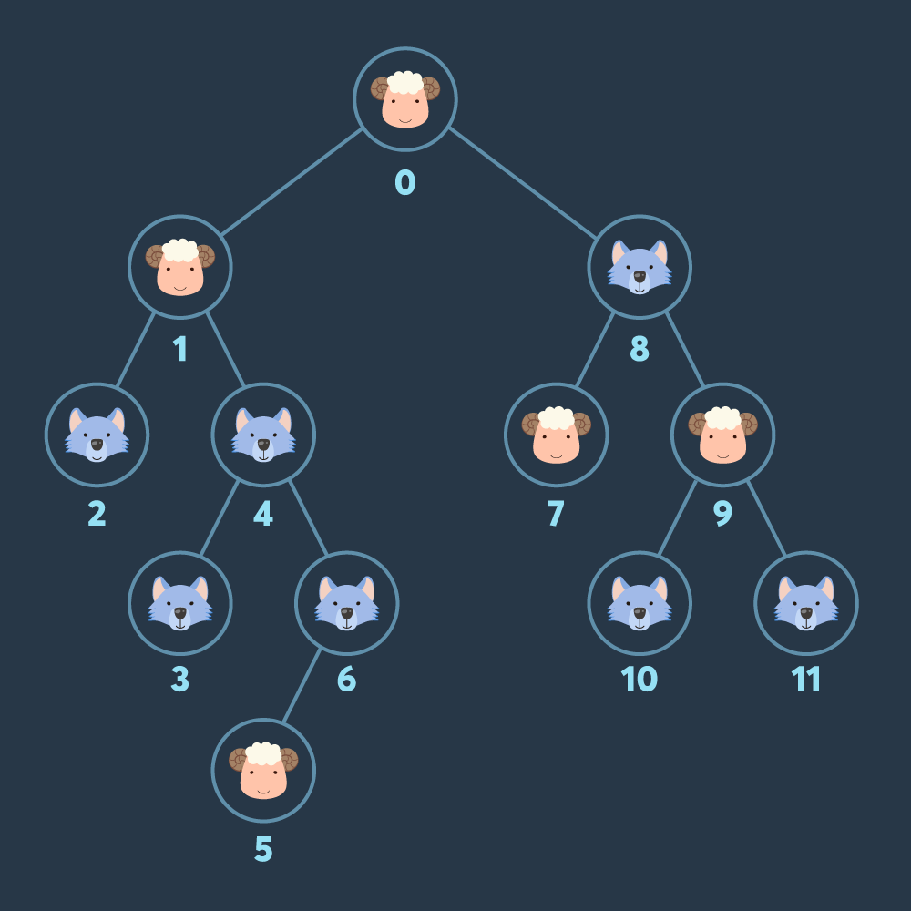

예를 들어, 위 그림의 경우(루트 노드에는 항상 양이 있습니다) 0번 노드(루트 노드)에서 출발하면 양을 한마리 모을 수 있습니다. 다음으로 1번 노드로 이동하면 당신이 모은 양은 두 마리가 됩니다. 이때, 바로 4번 노드로 이동하면 늑대 한 마리가 당신을 따라오게 됩니다. 아직은 양 2마리, 늑대 1마리로 양이 잡아먹히지 않지만, 이후에 갈 수 있는 아직 방문하지 않은 모든 노드(2, 3, 6, 8번)에는 늑대가 있습니다. 이어서 늑대가 있는 노드로 이동한다면(예를 들어 바로 6번 노드로 이동한다면) 양 2마리, 늑대 2마리가 되어 양이 모두 잡아먹힙니다. 여기서는 0번, 1번 노드를 방문하여 양을 2마리 모은 후, 8번 노드로 이동한 후(양 2마리 늑대 1마리) 이어서 7번, 9번 노드를 방문하면 양 4마리 늑대 1마리가 됩니다. 이제 4번, 6번 노드로 이동하면 양 4마리, 늑대 3마리가 되며, 이제 5번 노드로 이동할 수 있게 됩니다. 따라서 양을 최대 5마리 모을 수 있습니다.

각 노드에 있는 양 또는 늑대에 대한 정보가 담긴 배열 `info`, 2진 트리의 각 노드들의 연결 관계를 담은 2차원 배열 `edges`가 매개변수로 주어질 때, 문제에 제시된 조건에 따라 각 노드를 방문하면서 모을 수 있는 양은 최대 몇 마리인지 return 하도록 solution 함수를 완성해주세요.

[제한 사항]
------
- 2 ≤ `info`의 길이 ≤ 17
	- `info`의 원소는 0 또는 1 입니다.
	- `info[i]`는 `i`번 노드에 있는 양 또는 늑대를 나타냅니다.
	- 0은 양, 1은 늑대를 의미합니다.
	- `info[0]`의 값은 항상 0입니다. 즉, 0번 노드(루트 노드)에는 항상 양이 있습니다.
- `edges`의 세로(행) 길이 = info의 길이 - 1
	- `edges`의 가로(열) 길이 = 2
	- `edges`의 각 행은 `[부모 노드 번호, 자식 노드 번호]` 형태로, 서로 연결된 두 노드를 나타냅니다.
	- 동일한 간선에 대한 정보가 중복해서 주어지지 않습니다.
	- 항상 하나의 이진 트리 형태로 입력이 주어지며, 잘못된 데이터가 주어지는 경우는 없습니다.
	- 0번 노드는 항상 루트 노드입니다.


[입출력 예]
------
|info|edges|result
|----|----|---|
[0,0,1,1,1,0,1,0,1,0,1,1]|[[0,1],[1,2],[1,4],[0,8],[8,7],[9,10],[9,11],[4,3],[6,5],[4,6],[8,9]]|5
[0,1,0,1,1,0,1,0,0,1,0]	|[[0,1],[0,2],[1,3],[1,4],[2,5],[2,6],[3,7],[4,8],[6,9],[9,10]]	|5


[입출력 예에 대한 설명]
------

**입출력 예 #1**

문제 예시와 같습니다.

**입출력 예 #2**

주어진 입력은 다음 그림과 같습니다.
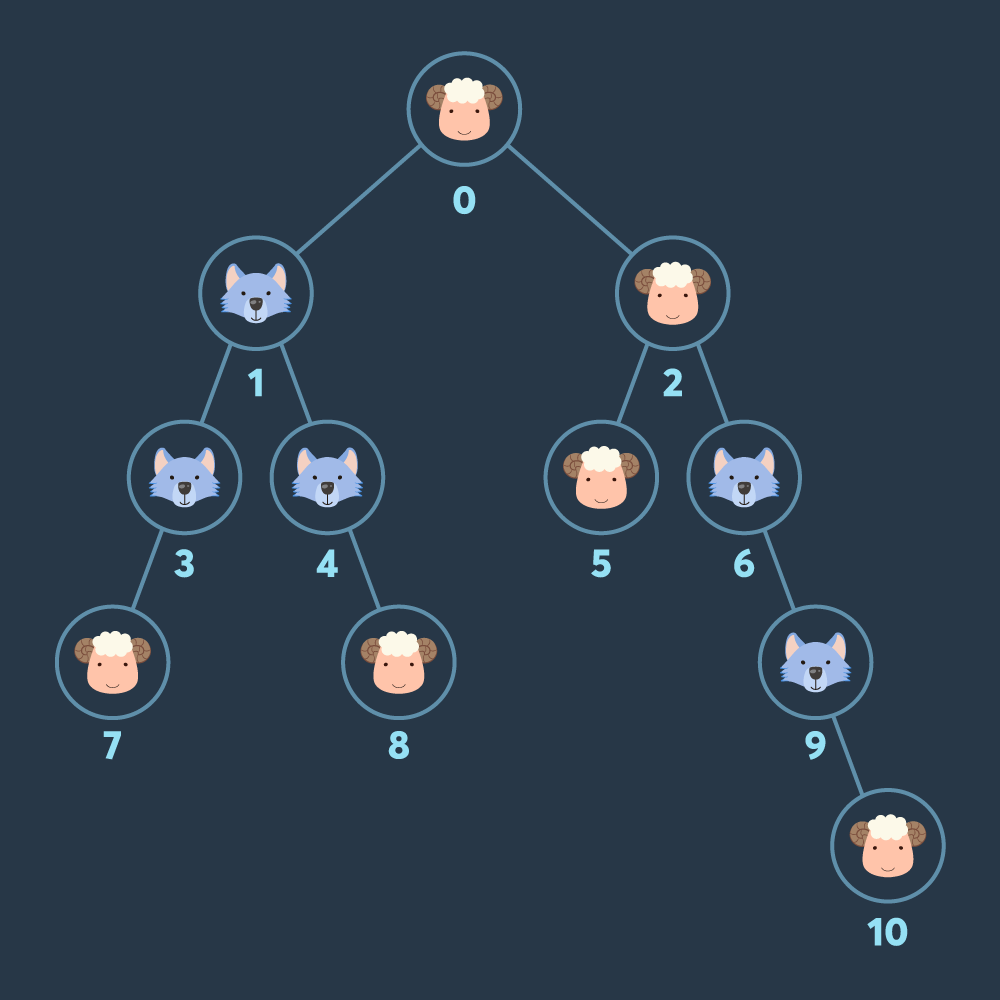
0번 - 2번 - 5번 - 1번 - 4번 - 8번 - 3번 - 7번 노드 순으로 이동하면 양 5마리 늑대 3마리가 됩니다. 여기서 6번, 9번 노드로 이동하면 양 5마리, 늑대 5마리가 되어 양이 모두 잡아먹히게 됩니다. 따라서 늑대에게 잡아먹히지 않도록 하면서 최대로 모을 수 있는 양은 5마리입니다.

[제한시간 안내]
------
정확성 테스트 : 10초

<br>

5\.&nbsp;경주로 건설(trackBuilding.py)
======
[문제 설명]
------

건설회사의 설계사인 `죠르디`는 고객사로부터 자동차 경주로 건설에 필요한 견적을 의뢰받았습니다.<br>
제공된 경주로 설계 도면에 따르면 경주로 부지는 `N x N` 크기의 정사각형 격자 형태이며 각 격자는 1 x 1 크기입니다.<br>
설계 도면에는 각 격자의 칸은 0 또는 1 로 채워져 있으며, 0은 칸이 비어 있음을 1은 해당 칸이 벽으로 채워져 있음을 나타냅니다.
<br>경주로의 출발점은 (0, 0) 칸(좌측 상단)이며, 도착점은 (N-1, N-1) 칸(우측 하단)입니다. 죠르디는 출발점인 (0, 0) 칸에서 출발한 자동차가 도착점인 (N-1, N-1) 칸까지 무사히 도달할 수 있게 중간에 끊기지 않도록 경주로를 건설해야 합니다.<br>
경주로는 상, 하, 좌, 우로 인접한 두 빈 칸을 연결하여 건설할 수 있으며, 벽이 있는 칸에는 경주로를 건설할 수 없습니다.<br>
이때, 인접한 두 빈 칸을 상하 또는 좌우로 연결한 경주로를 `직선 도로` 라고 합니다.<br>
또한 두 직선 도로가 서로 직각으로 만나는 지점을 `코너` 라고 부릅니다.<br>
건설 비용을 계산해 보니 `직선 도로` 하나를 만들 때는 100원이 소요되며, `코너`를 하나 만들 때는 500원이 추가로 듭니다.<br>
죠르디는 견적서 작성을 위해 경주로를 건설하는 데 필요한 최소 비용을 계산해야 합니다.<br>

예를 들어, 아래 그림은 직선 도로 6개와 코너 4개로 구성된 임의의 경주로 예시이며, 건설 비용은 6 x 100 + 4 x 500 = 2600원 입니다.


또 다른 예로, 아래 그림은 직선 도로 4개와 코너 1개로 구성된 경주로이며, 건설 비용은 4 x 100 + 1 x 500 = 900원 입니다.


도면의 상태(0은 비어 있음, 1은 벽)을 나타내는 2차원 배열 board가 매개변수로 주어질 때, 경주로를 건설하는데 필요한 최소 비용을 return 하도록 solution 함수를 완성해주세요.

[제한 사항]
------
- board는 2차원 정사각 배열로 배열의 크기는 3 이상 25 이하입니다.
- board 배열의 각 원소의 값은 0 또는 1 입니다.
	- 도면의 가장 왼쪽 상단 좌표는 (0, 0)이며, 가장 우측 하단 좌표는 (N-1, N-1) 입니다.
	- 원소의 값 0은 칸이 비어 있어 도로 연결이 가능함을 1은 칸이 벽으로 채워져 있어 도로 연결이 불가능함을 나타냅니다.
- board는 항상 출발점에서 도착점까지 경주로를 건설할 수 있는 형태로 주어집니다.
- 출발점과 도착점 칸의 원소의 값은 항상 0으로 주어집니다.


[입출력 예]
------
board|	result|
|---|---|
[[0,0,0],[0,0,0],[0,0,0]]	|900
[[0,0,0,0,0,0,0,1],[0,0,0,0,0,0,0,0],[0,0,0,0,0,1,0,0],[0,0,0,0,1,0,0,0],[0,0,0,1,0,0,0,1],[0,0,1,0,0,0,1,0],[0,1,0,0,0,1,0,0],[1,0,0,0,0,0,0,0]]	|3800
[[0,0,1,0],[0,0,0,0],[0,1,0,1],[1,0,0,0]]	|2100
[[0,0,0,0,0,0],[0,1,1,1,1,0],[0,0,1,0,0,0],[1,0,0,1,0,1],[0,1,0,0,0,1],[0,0,0,0,0,0]]	|3200


[입출력 예에 대한 설명]
------

**입출력 예 #1**

본문의 예시와 같습니다.

**입출력 예 #2**

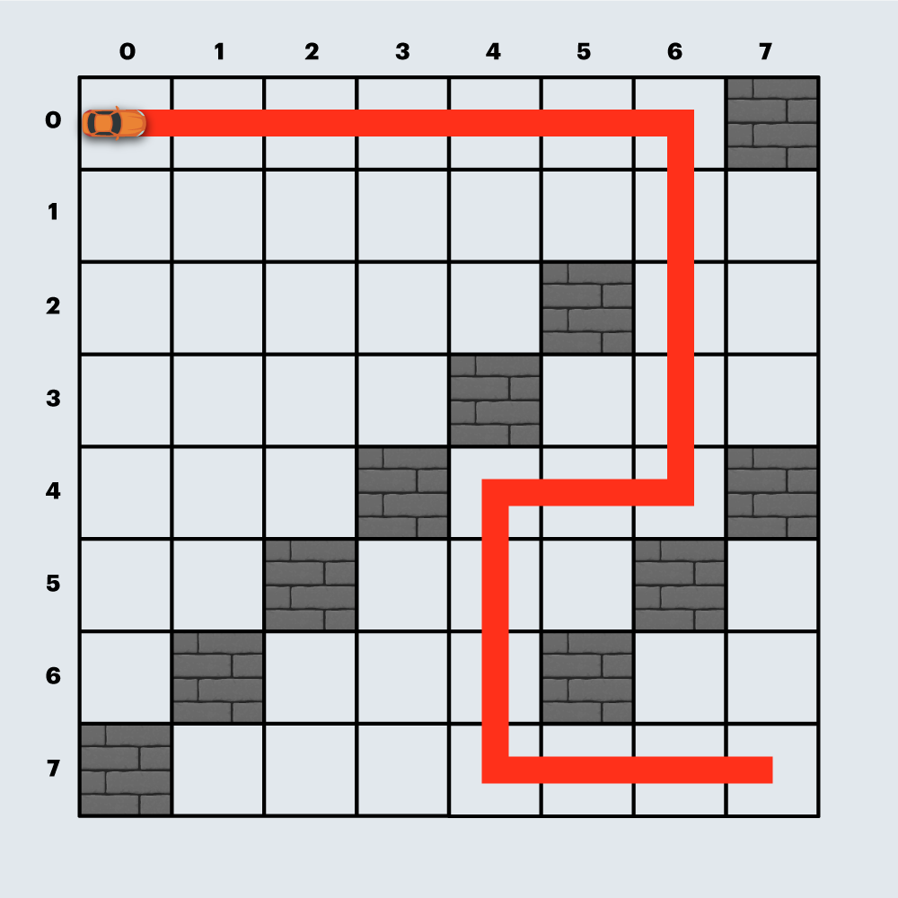

위와 같이 경주로를 건설하면 직선 도로 18개, 코너 4개로 총 `3800`원이 듭니다.

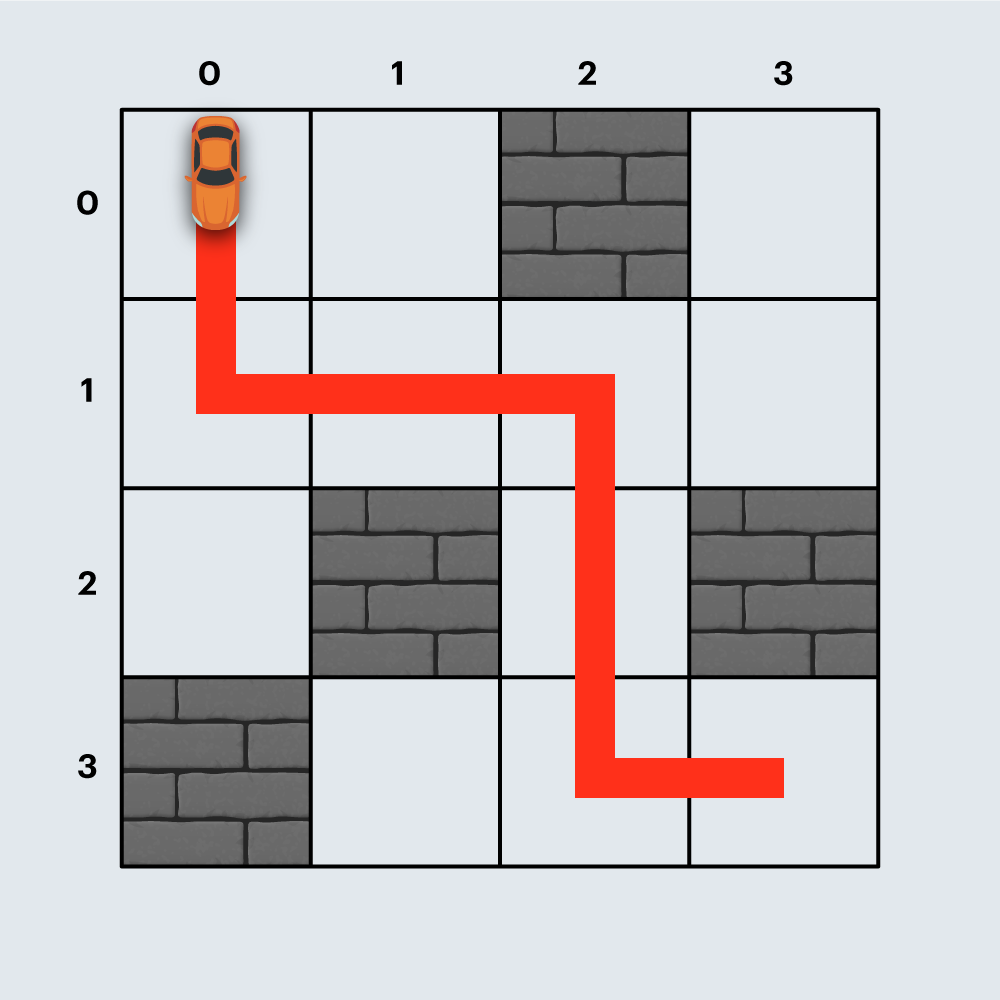

위와 같이 경주로를 건설하면 직선 도로 6개, 코너 3개로 총 `2100`원이 듭니다.

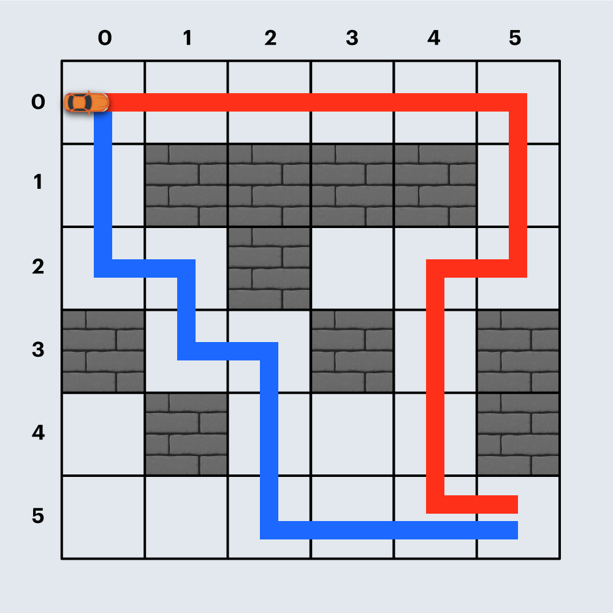

붉은색 경로와 같이 경주로를 건설하면 직선 도로 12개, 코너 4개로 총 `3200`원이 듭니다.
만약, 파란색 경로와 같이 경주로를 건설한다면 직선 도로 10개, 코너 5개로 총 `3500`원이 들며, 더 많은 비용이 듭니다.

[제한시간 안내]
------
정확성 테스트 : 10초

6\.&nbsp;카드 짝 맞추기(cardPairing.py)
======
[문제]
------
게임 개발자인 `베로니`는 개발 연습을 위해 다음과 같은 간단한 카드 짝맞추기 보드 게임을 개발해 보려고 합니다.<br>
게임이 시작되면 화면에는 카드 16장이 뒷면을 위로하여 4 x 4 크기의 격자 형태로 표시되어 있습니다. 각 카드의 앞면에는 카카오프렌즈 캐릭터 그림이 그려져 있으며, 8가지의 캐릭터 그림이 그려진 카드가 각기 2장씩 화면에 무작위로 배치되어 있습니다.<br>
유저가 카드를 2장 선택하여 앞면으로 뒤집었을 때 같은 그림이 그려진 카드면 해당 카드는 게임 화면에서 사라지며, 같은 그림이 아니라면 원래 상태로 뒷면이 보이도록 뒤집힙니다. 이와 같은 방법으로 모든 카드를 화면에서 사라지게 하면 게임이 종료됩니다.<br>

게임에서 카드를 선택하는 방법은 다음과 같습니다.

- 카드는 커서를 이용해서 선택할 수 있습니다.
	- 커서는 4 x 4 화면에서 유저가 선택한 현재 위치를 표시하는 "굵고 빨간 테두리 상자"를 의미합니다.
- 커서는 [Ctrl] 키와 방향키에 의해 이동되며 키 조작법은 다음과 같습니다.
	- 방향키 ←, ↑, ↓, → 중 하나를 누르면, 커서가 누른 키 방향으로 1칸 이동합니다.
	- [Ctrl] 키를 누른 상태에서 방향키 ←, ↑, ↓, → 중 하나를 누르면, 누른 키 방향에 있는 가장 가까운 카드로 한번에 이동합니다.
		- 만약, 해당 방향에 카드가 하나도 없다면 그 방향의 가장 마지막 칸으로 이동합니다.
	- 만약, 누른 키 방향으로 이동 가능한 카드 또는 빈 공간이 없어 이동할 수 없다면 커서는 움직이지 않습니다.
- 커서가 위치한 카드를 뒤집기 위해서는 [Enter] 키를 입력합니다.
	- [Enter] 키를 입력해서 카드를 뒤집었을 때
		- 앞면이 보이는 카드가 1장 뿐이라면 그림을 맞출 수 없으므로 두번째 카드를 뒤집을 때 까지 앞면을 유지합니다.
		- 앞면이 보이는 카드가 2장이 된 경우, 두개의 카드에 그려진 그림이 같으면 해당 카드들이 화면에서 사라지며, 그림이 다르다면 두 카드 모두 뒷면이 보이도록 다시 뒤집힙니다.<br>

`베로니`는 게임 진행 중 카드의 짝을 맞춰 몇 장 제거된 상태에서 카드 앞면의 그림을 알고 있다면, 남은 카드를 모두 제거하는데 필요한 키 조작 횟수의 최솟값을 구해 보려고 합니다. 키 조작 횟수는 방향키와 [Enter] 키를 누르는 동작을 각각 조작 횟수 `1`로 계산하며, [Ctrl] 키와 방향키를 함께 누르는 동작 또한 조작 횟수 1로 계산합니다.

다음은 카드가 몇 장 제거된 상태의 게임 화면에서 커서를 이동하는 예시입니다.
아래 그림에서 빈 칸은 이미 카드가 제거되어 없어진 칸을 의미하며, 그림이 그려진 칸은 카드 앞 면에 그려진 그림을 나타냅니다.

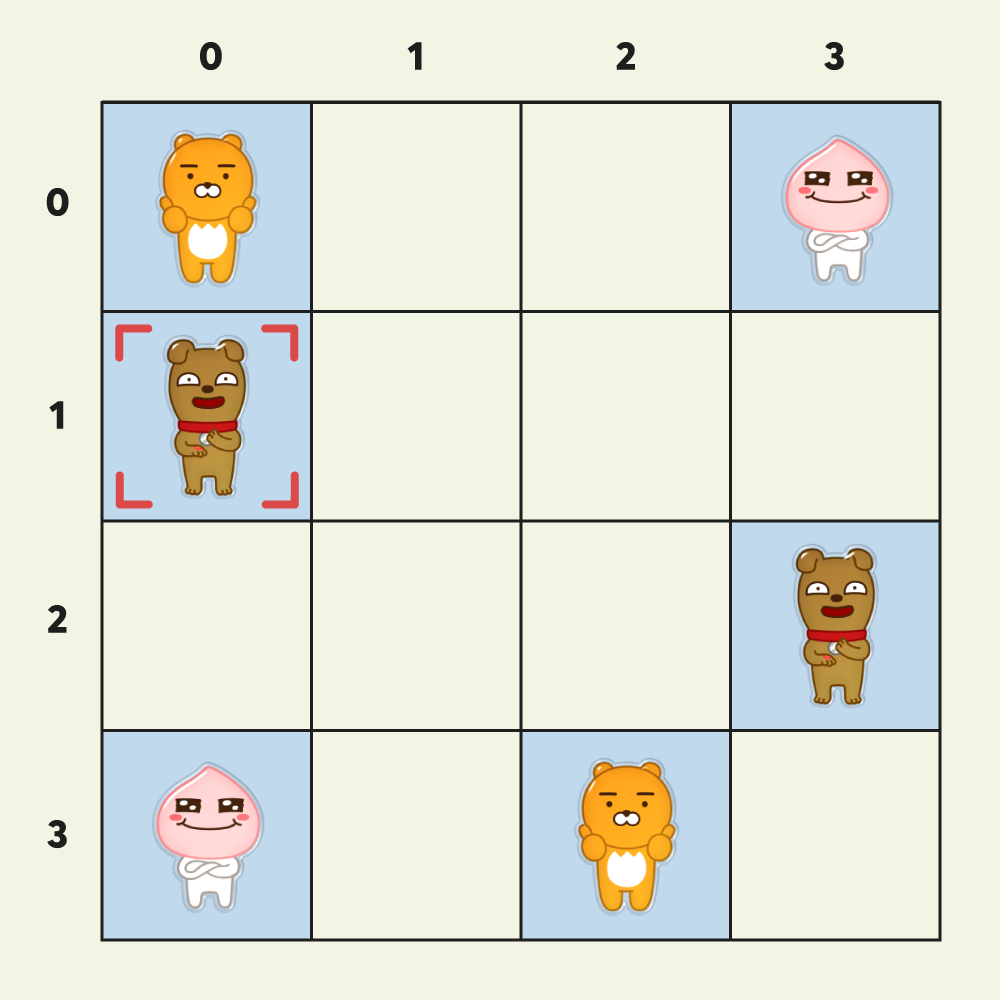
예시에서 커서는 두번째 행, 첫번째 열 위치에서 시작하였습니다.
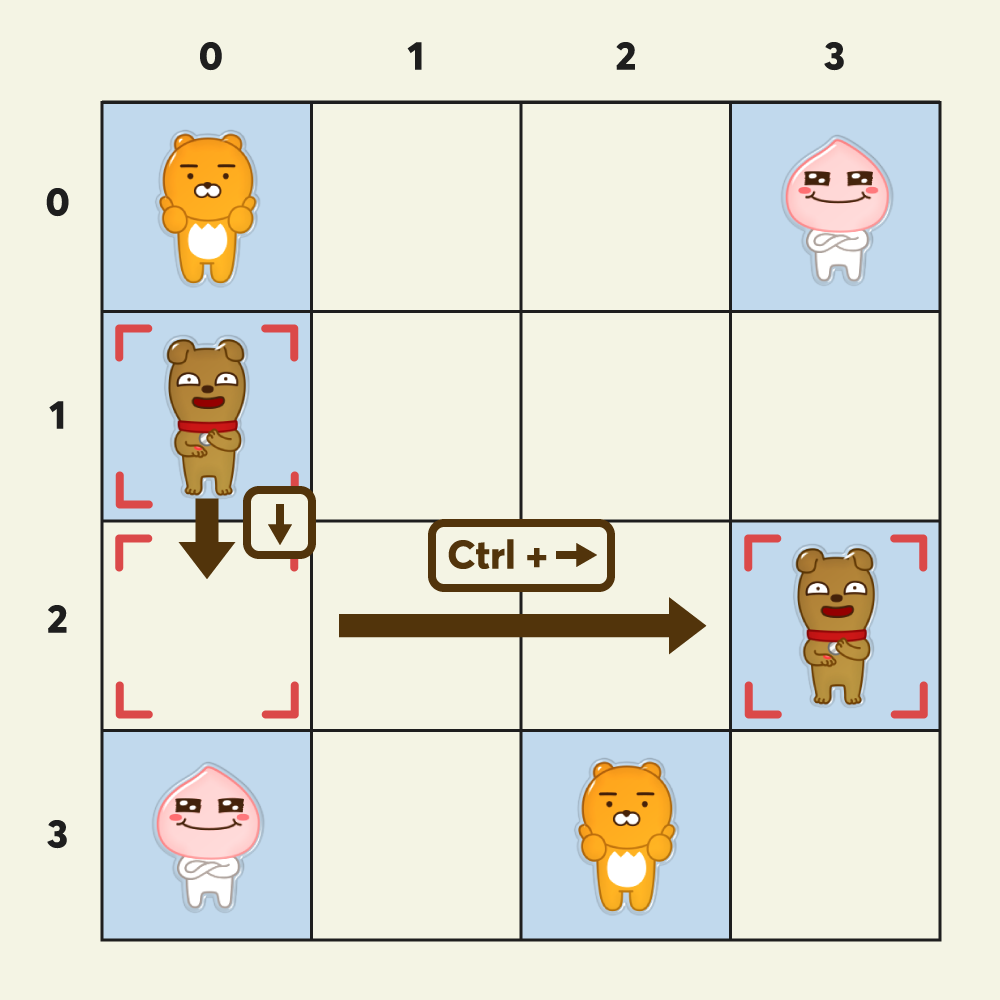
[Enter] 입력, ↓ 이동, [Ctrl]+→ 이동, [Enter] 입력 = 키 조작 4회
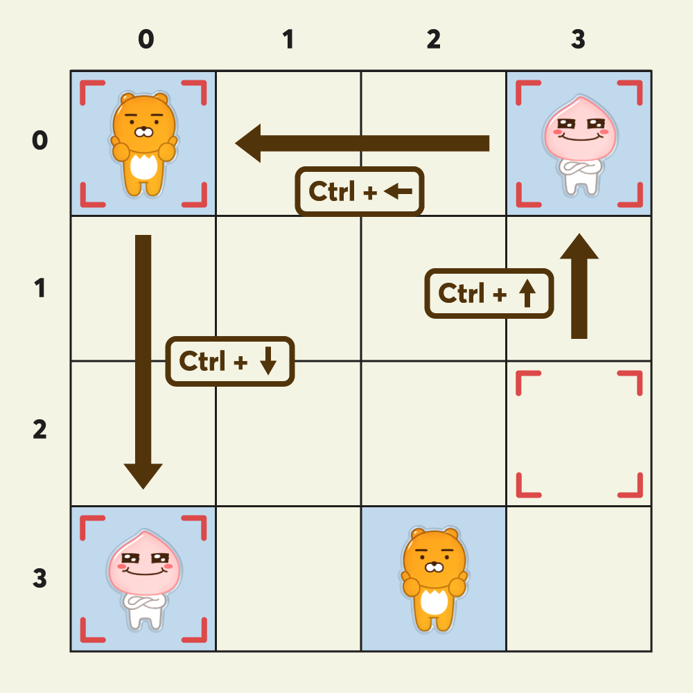
[Ctrl]+↑ 이동, [Enter] 입력, [Ctrl]+← 이동, [Ctrl]+↓ 이동, [Enter] 입력 = 키 조작 5회
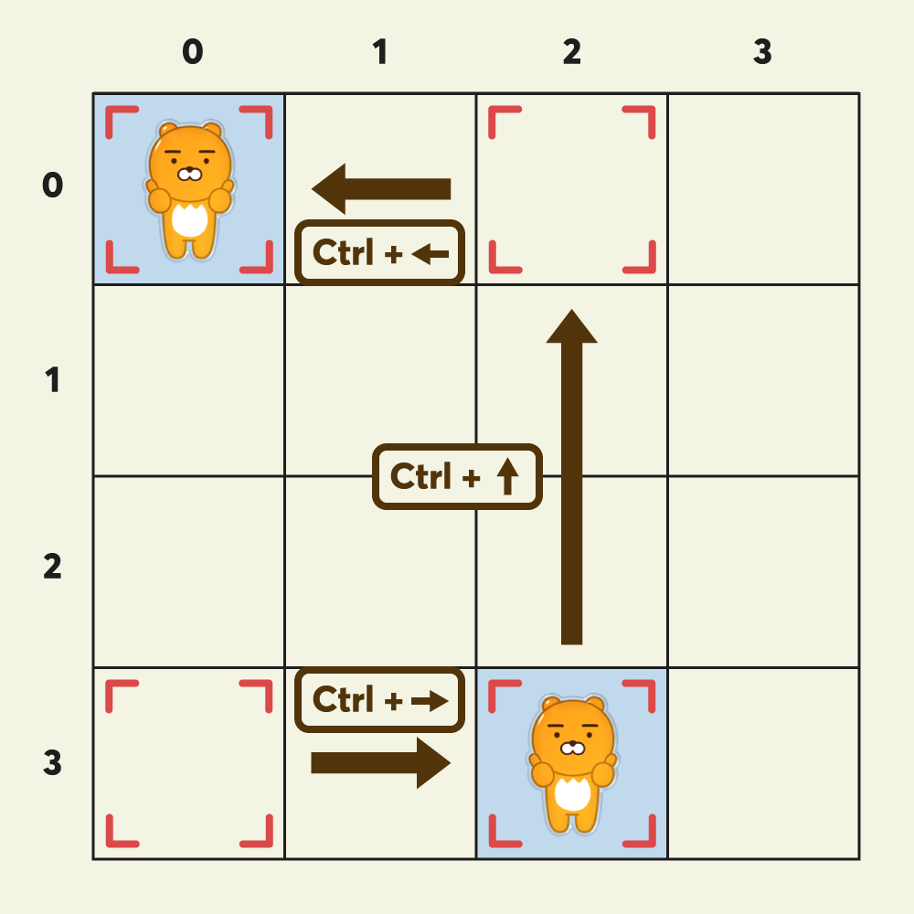
[Ctrl]+→ 이동, [Enter] 입력, [Ctrl]+↑ 이동, [Ctrl]+← 이동, [Enter] 입력 = 키 조작 5회

위와 같은 방법으로 커서를 이동하여 카드를 선택하고 그림을 맞추어 카드를 모두 제거하기 위해서는 총 14번(방향 이동 8번, [Enter] 키 입력 6번)의 키 조작 횟수가 필요합니다.

[문제]
------
현재 카드가 놓인 상태를 나타내는 2차원 배열 board와 커서의 처음 위치 r, c가 매개변수로 주어질 때, 모든 카드를 제거하기 위한 키 조작 횟수의 최솟값을 return 하도록 solution 함수를 완성해 주세요.

[제한 사항]
------
- board는 4 x 4 크기의 2차원 배열입니다.
- board 배열의 각 원소는 0 이상 6 이하인 자연수입니다.
	- 0은 카드가 제거된 빈 칸을 나타냅니다.
	- 1 부터 6까지의 자연수는 2개씩 들어있으며 같은 숫자는 같은 그림의 카드를 의미합니다.
	- 뒤집을 카드가 없는 경우(board의 모든 원소가 0인 경우)는 입력으로 주어지지 않습니다.
- r은 커서의 최초 세로(행) 위치를 의미합니다.
- c는 커서의 최초 가로(열) 위치를 의미합니다.
- r과 c는 0 이상 3 이하인 정수입니다.
- 게임 화면의 좌측 상단이 (0, 0), 우측 하단이 (3, 3) 입니다.


[입출력 예]
------
board|	r|	c|	result
|---|---|---|---|
[[1,0,0,3],[2,0,0,0],[0,0,0,2],[3,0,1,0]]	|1|	0|	14
[[3,0,0,2],[0,0,1,0],[0,1,0,0],[2,0,0,3]]	|0	|1|	16

[입출력 예에 대한 설명]
------
**입출력 예 #1**

문제의 예시와 같습니다.

**입출력 예 #2**

입력으로 주어진 게임 화면은 아래 그림과 같습니다.
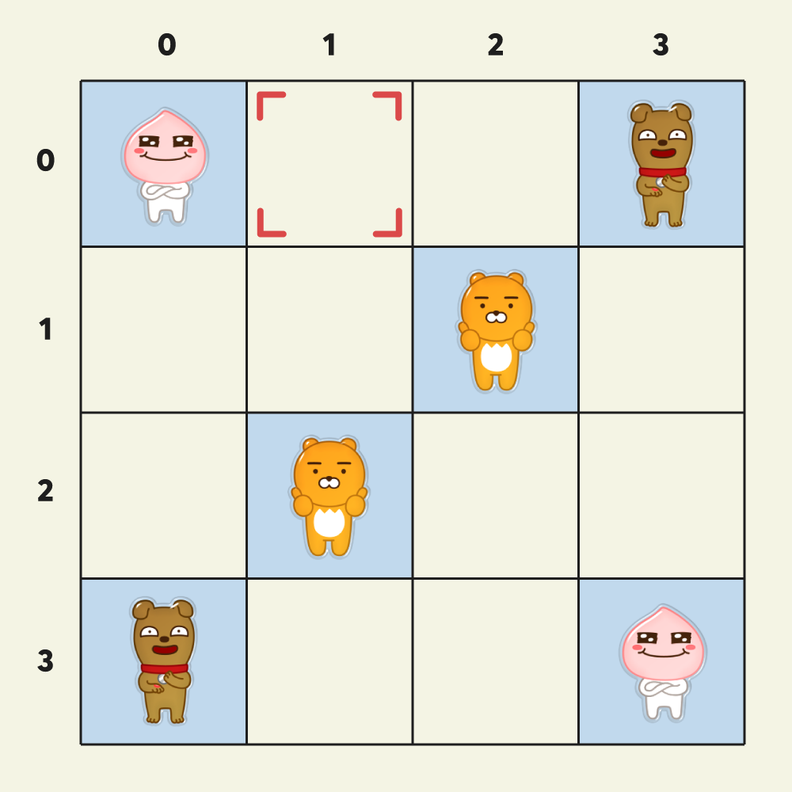
위 게임 화면에서 모든 카드를 제거하기 위한 키 조작 횟수의 최솟값은 16번 입니다.

7\.&nbsp;미로 탈출 명령어(mazeCommand.py)
======
[문제]
------
`n` x `m` 격자 미로가 주어집니다. 당신은 미로의 (x, y)에서 출발해 (r, c)로 이동해서 탈출해야 합니다.

단, 미로를 탈출하는 조건이 세 가지 있습니다.

1. 격자의 바깥으로는 나갈 수 없습니다.
2. (x, y)에서 (r, c)까지 이동하는 거리가 총 k여야 합니다. 이때, (x, y)와 (r, c)격자를 포함해, 같은 격자를 두 번 이상 방문해도 됩니다.
3. 미로에서 탈출한 경로를 문자열로 나타냈을 때, 문자열이 사전 순으로 가장 빠른 경로로 탈출해야 합니다.
이동 경로는 다음과 같이 문자열로 바꿀 수 있습니다.

- l: 왼쪽으로 한 칸 이동
- r: 오른쪽으로 한 칸 이동
- u: 위쪽으로 한 칸 이동
- d: 아래쪽으로 한 칸 이동

예를 들어, 왼쪽으로 한 칸, 위로 한 칸, 왼쪽으로 한 칸 움직였다면, 문자열 `"lul"`로 나타낼 수 있습니다.

미로에서는 인접한 상, 하, 좌, 우 격자로 한 칸씩 이동할 수 있습니다.

예를 들어 다음과 같이 3 x 4 격자가 있다고 가정해 보겠습니다.
```
....
..S.
E...
```

미로의 좌측 상단은 (1, 1)이고 우측 하단은 (3, 4)입니다. `.`은 빈 공간, `S`는 출발 지점, `E`는 탈출 지점입니다.

탈출까지 이동해야 하는 거리 `k`가 5라면 다음과 같은 경로로 탈출할 수 있습니다.

1. lldud
2. ulldd
3. rdlll
4. dllrl
5. dllud
6. ...

이때 dllrl보다 사전 순으로 빠른 경로로 탈출할 수는 없습니다.

격자의 크기를 뜻하는 정수 `n`, `m`, 출발 위치를 뜻하는 정수 `x`, `y`, 탈출 지점을 뜻하는 정수 `r`, `c`, 탈출까지 이동해야 하는 거리를 뜻하는 정수 `k`가 매개변수로 주어집니다. 이때, 미로를 탈출하기 위한 경로를 return 하도록 solution 함수를 완성해주세요. 단, 위 조건대로 미로를 탈출할 수 없는 경우 `"impossible"`을 return 해야 합니다.

[제한 사항]
------
- 2 ≤ `n` (= 미로의 세로 길이) ≤ 50
- 2 ≤ `m` (= 미로의 가로 길이) ≤ 50
- 1 ≤ `x` ≤ `n`
- 1 ≤ `y` ≤ `m`
- 1 ≤ `r` ≤ `n`
- 1 ≤ `c` ≤ `m`
- (`x`, `y`) ≠ (`r`, `c`)
- 1 ≤ `k` ≤ 2,500


[입출력 예]
------
n|	m|	x|	y|	r|	c|	k|	result
|--|--|--|--|--|--|--|--|
3|	4|	2|	3|	3|	1|	5|	"dllrl"
2|	2|	1|	1|	2|	2|	2|	"dr"
3|	3|	1|	2|	3|	3|	4|	"impossible"

[입출력 예에 대한 설명]
------
**입출력 예 #1**

문제 예시와 동일합니다.

**입출력 예 #2**

미로의 크기는 2 x 2입니다. 출발 지점은 (1, 1)이고, 탈출 지점은 (2, 2)입니다.

빈 공간은 `.`, 출발 지점을 `S`, 탈출 지점을 `E`로 나타내면 다음과 같습니다.
```
S.
.E
```
미로의 좌측 상단은 (1, 1)이고 우측 하단은 (2, 2)입니다.

탈출까지 이동해야 하는 거리 `k`가 2이므로 다음과 같은 경로로 탈출할 수 있습니다.

1. rd
2. dr

`"dr"`이 사전 순으로 가장 빠른 경로입니다. 따라서 `"dr"`을 return 해야 합니다.

**입출력 예 #3**

미로의 크기는 3 x 3입니다. 출발 지점은 (1, 2)이고, 탈출 지점은 (3, 3)입니다.

빈 공간은 `.`, 출발 지점을 `S`, 탈출 지점을 `E`로 나타내면 다음과 같습니다.
```
.S.
...
..E
```
미로의 좌측 상단은 (1, 1)이고 우측 하단은 (3, 3)입니다.

탈출까지 이동해야 하는 거리 `k`가 4입니다. 이때, 이동 거리가 4이면서, `S`에서 `E`까지 이동할 수 있는 경로는 존재하지 않습니다.

따라서 `"impossible"`을 return 해야 합니다.