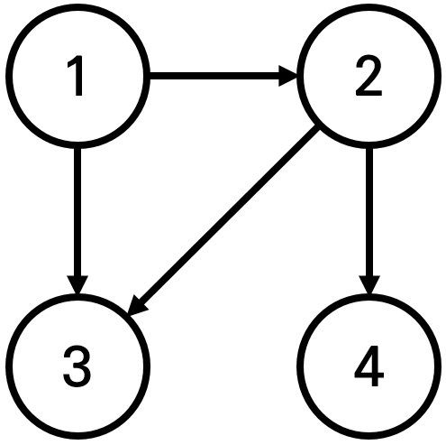
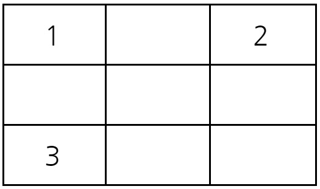
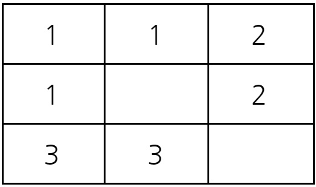
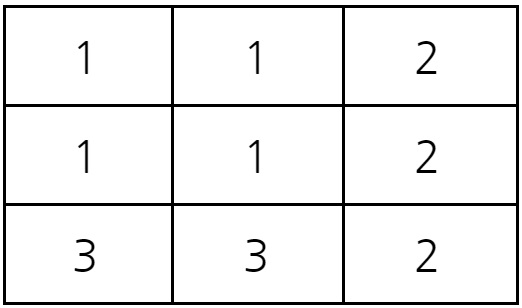

1\.&nbsp;음료수 얼려먹기(freeze.py)
======
[문제]
------
N x M 크기의 얼음 틀이 있다. 구멍이 뚫려 있는 부분은 0, 칸막이가 존재하는 부분은 1로 표시된다. 구멍이 뚫려 있는 부분끼리 상, 하, 좌, 우로 붙어 있는 경우 서로 연결되어 있는 것으로 간주한다. 이때 얼음 틀의 모양이 주어졌을 때 생성되는 총 아이스크림의 개수를 구하는 프로그램을 작성하시오.  
예시) 다음의 4 x 5 얼음 틀 예시에서는 아이스크림이 총 3개 생성된다.

[입력 조건]
------
- 첫 번째 줄에 얼음 틀의 세로 길이 N과 가로 길이 M이 주어진다.
(1 <= N, M <= 1,000)
- 두 번째 줄부터 N + 1번째 줄까지 얼음 틀의 형태가 주어진다.
- 이때 구멍이 뚫려있는 부분은 0, 그렇지 않은 부분은 1이다.

[출력 조건]
------
- 한 번에 만들 수 있는 아이스크림의 개수를 출력한다.
 

2\.&nbsp;미로탈출(maze.py)
======
[문제]
------
N x M 크기의 직사각형 형태의 미로에 여러 마리의 괴물이 있어 이를 피해 탈출해야 한다. 현재 위치는 (1, 1)이고 미로의 출구는 (N,M)의 위치에 존재하며 한 번에 한 칸씩 이동할 수 있다. 괴물이 있는 부분은 0으로, 괴물이 없는 부분은 1로 표시되어 있다. 미로는 반드시 탈출할 수 있는 형태로 제시된다. 탈출하기 위해 움직여야 하는 최소 칸의 개수를 구하라. 칸을 셀 때는 시작 칸과 마지막 칸을 모두 포함해서 계산한다.

[입력 조건]
------
- 첫째 줄에 두 정수 N, M(4 <= N, M <= 200)이 주어진다. 다음 N개의 줄에는 각각 M개의 정수(0혹은 1)로 미로의 정보가 주어진다. 각각의 수들은 공백 없이붙어서 입력으로 제시된다. 또한 시작 칸과 마지막 칸은 항상 1이다.

[출력 조건]
------
- 첫째 줄에 최소 이동 칸의 개수를 출력한다.

[입력 예시]
------
    5 6
    101010
    111111
    000001
    111111
    111111
[출력 예시]
------
    10

3\.&nbsp;부품찾기(searchParts.py)
======
[문제]
------
동빈이네 전자 매장에는 부품이 N개 있다. 각 부품은 정수 형태의 고유한 번호가 있다. 어느 날 손님이 M개의 종류의 부품을 대량으로 구매하겠다며 당일 날 견적서를 요청했다. 동빈이는 때를 놓치지 않고 손님이 문의한 부품 M개 종류를 모두 확인해서 견적서를 작성해야 한다. 이때 가게 안에 부품이 모두 있는지 확인하는 프로그램을 작성해보자.
예를 들어 가게의 부품이 총 5개일 때 부품 번호가 다음과 같다고 하자.

    N=5
    [8, 3, 7, 9, 2]
손님은 총 3개의 부품이 있는지 확인 요청했는데 부품 번호는 다음과 같다.

    M=3
    [5, 7, 9]
이때 손님이 요청한 부품 번호의 순서대로 부품을 확인해 부품이 있으면 yes를, 없으면 no를 출력한다. 구분은 공백으로 한다.

[입력 조건]
------
- 첫째 줄에 정수 N이 주어진다. (1<=N<=1,000,000)
- 둘째 줄에는 공백으로 구분하여 N개의 정수가 주어진다. 이때 정수는 1보다 크고 1,000,000 이하이다.
- 셋째 줄에는 정수 M이 주어진다. (1<=M<=100,000)
- 넷째 줄에는 공백으로 구분하여 M개의 정수가 주어진다. 이때 정수는 1보다 크고 10억 이하이다.

[출력 조건]
------
- 첫째 줄에 공백으로 구분하여 각 부품이 존재하면 yes를, 없으면 no를 출력한다.

[입력 예시]
------
    5
    8 3 7 9 2
    3
    5 7 9
[출력 예시]
------
    no yes yes
 

4\.&nbsp;떡볶이 떡 만들기(tteokbokki.py)
======
[문제]
------
오늘은 떡볶이 떡을 만드는 날이다. 떡볶이 떡의 길이가 일정하지 않지만 한 봉지 안에 들어가는 떡의 총 길이는 절단기로 잘라 맞춘다.

절단기에 높이(H)를 지정하면 줄지어진 떡을 한 번에 절단한다.
높이가 H보다 긴 떡은 H 위의 부분이 잘릴 것이고, 낮은 떡은 잘리지 않는다.

예를 들어 높이가 19, 14, 10, 17cm인 떡이 나란히 있고 절단기 높이를 15cm로 지정하면 자른 뒤 떡의 높이는 15, 14, 10, 15cm가 될 것이다.

잘린 떡의 길이는 차례대로 4, 0, 0, 2cm이다. 손님은 6cm만큼의 길이를 가져간다.

손님이 왔을 때 요청한 총 길이가 M일 때 적어도 M만큼의 떡을 얻기 위해 절단기에 설정할 수 있는 높이의 최댓값을 구하는 프로그램을 작성하시오.

[입력 조건]
------
- 첫째 줄에 떡의 개수 N과 요청한 떡의 길이 M이 주어진다. 
(1 <= N <= 1,000,000 | 1 <= M <= 2,000,000,000)
- 둘째 줄에는 떡의 개별 높이가 주어진다. 떡 높이의 총합은 항상 M 이상이다.
- 높이는 0 이상 10억 이하이다.

[출력 조건]
------
- 적어도 M만큼의 떡을 집에 가져가기 위해 절단기에 설정할 수 있는 높이의 최댓값을 출력한다.

[입력 예시]
------
    4 6
    19 15 10 17
[출력 예시]
------
    15
 

5\.&nbsp;특정 거리의 도시 찾기(searchCity.py)
======
[문제]
------
어떤 나라에는 1번부터 N번까지의 도시와 M개의 단방향 도로가 존재한다. 모든 도로의 거리는 1이다.

이 때 특정한 도시 X로부터 출발하여 도달할 수 있는 모든 도시 중에서, 최단 거리가 정확히 K인 모든 도시들의 번호를 출력하는 프로그램을 작성하시오. 또한 출발 도시 X에서 출발 도시 X로 가는 최단 거리는 항상 0이라고 가정한다.

예를 들어 N=4, K=2, X=1일 때 다음과 같이 그래프가 구성되어 있다고 가정하자.

이 때 1번 도시에서 출발하여 도달할 수 있는 도시 중에서, 최단 거리가 2인 도시는 4번 도시 뿐이다.  2번과 3번 도시의 경우, 최단 거리가 1이기 때문에 출력하지 않는다.

[입력 조건]
------
- 첫째 줄에 도시의 개수 N, 도로의 개수 M, 거리 정보 K, 출발 도시의 번호 X가 주어진다. 
  - (2 ≤ N ≤ 300,000, 1 ≤ M ≤ 1,000,000, 1 ≤ K ≤ 300,000, 1 ≤ X ≤ N) 
- 둘째 줄부터 M개의 줄에 걸쳐서 두 개의 자연수 A, B가 공백을 기준으로 구분되어 주어진다. 이는 A번 도시에서 B번 도시로 이동하는 단방향 도로가 존재한다는 의미다. 
  - (1 ≤ A, B ≤ N) 단, A와 B는 서로 다른 자연수이다.

[출력 조건]
------
- X로부터 출발하여 도달할 수 있는 도시 중에서, 최단 거리가 K인 모든 도시의 번호를 한 줄에 하나씩 오름차순으로 출력한다.

- 이 때 도달할 수 있는 도시 중에서, 최단 거리가 K인 도시가 하나도 존재하지 않으면 -1을 출력한다.

[입력 예시]
------
**입력 1**
~~~
4 4 2 1
1 2
1 3
2 3
2 4
~~~

**입력 2**
~~~
4 3 2 1
1 2
1 3
1 4
~~~

**입력 3**
~~~
4 4 1 1
1 2
1 3
2 3
2 4
~~~
[출력 예시]
------
**출력 1**
~~~
4
~~~

**출력 2**
~~~
-1
~~~

**출력 3**
~~~
2
3
~~~
 

6\.&nbsp;연구소(lab.py)
======
[문제]
------
인체에 치명적인 바이러스를 연구하던 연구소에서 바이러스가 유출되었다. 다행히 바이러스는 아직 퍼지지 않았고, 바이러스의 확산을 막기 위해서 연구소에 벽을 세우려고 한다.

연구소는 크기가 N×M인 직사각형으로 나타낼 수 있으며, 직사각형은 1×1 크기의 정사각형으로 나누어져 있다. 연구소는 빈 칸, 벽으로 이루어져 있으며, 벽은 칸 하나를 가득 차지한다. 

일부 칸은 바이러스가 존재하며, 이 바이러스는 상하좌우로 인접한 빈 칸으로 모두 퍼져나갈 수 있다. 새로 세울 수 있는 벽의 개수는 3개이며, 꼭 3개를 세워야 한다.

예를 들어, 아래와 같이 연구소가 생긴 경우를 살펴보자.

    2 0 0 0 1 1 0
    0 0 1 0 1 2 0
    0 1 1 0 1 0 0
    0 1 0 0 0 0 0
    0 0 0 0 0 1 1
    0 1 0 0 0 0 0
    0 1 0 0 0 0 0

이때, 0은 빈 칸, 1은 벽, 2는 바이러스가 있는 곳이다. 아무런 벽을 세우지 않는다면, 바이러스는 모든 빈 칸으로 퍼져나갈 수 있다.

2행 1열, 1행 2열, 4행 6열에 벽을 세운다면 지도의 모양은 아래와 같아지게 된다.

    2 1 0 0 1 1 0
    1 0 1 0 1 2 0
    0 1 1 0 1 0 0
    0 1 0 0 0 1 0
    0 0 0 0 0 1 1
    0 1 0 0 0 0 0
    0 1 0 0 0 0 0

바이러스가 퍼진 뒤의 모습은 아래와 같아진다.

    2 1 0 0 1 1 2
    1 0 1 0 1 2 2
    0 1 1 0 1 2 2
    0 1 0 0 0 1 2
    0 0 0 0 0 1 1
    0 1 0 0 0 0 0
    0 1 0 0 0 0 0
벽을 3개 세운 뒤, 바이러스가 퍼질 수 없는 곳을 안전 영역이라고 한다. 위의 지도에서 안전 영역의 크기는 27이다.

연구소의 지도가 주어졌을 때 얻을 수 있는 안전 영역 크기의 최댓값을 구하는 프로그램을 작성하시오.
[입력 조건]
------
- 첫째 줄에 지도의 세로 크기 N과 가로 크기 M이 주어진다. (3 ≤ N, M ≤ 8)

- 둘째 줄부터 N개의 줄에 지도의 모양이 주어진다. 0은 빈 칸, 1은 벽, 2는 바이러스가 있는 위치이다. 2의 개수는 2보다 크거나 같고, 10보다 작거나 같은 자연수이다.

- 빈 칸의 개수는 3개 이상이다.

[출력 조건]
------
- 첫째 줄에 얻을 수 있는 안전 영역의 최대 크기를 출력한다.

[입력 예시]
-----
**입력 1**

    7 7
    2 0 0 0 1 1 0
    0 0 1 0 1 2 0
    0 1 1 0 1 0 0
    0 1 0 0 0 0 0
    0 0 0 0 0 1 1
    0 1 0 0 0 0 0
    0 1 0 0 0 0 0

**입력 2**

    4 6
    0 0 0 0 0 0
    1 0 0 0 0 2
    1 1 1 0 0 2
    0 0 0 0 0 2

**입력 3**

    8 8
    2 0 0 0 0 0 0 2
    2 0 0 0 0 0 0 2
    2 0 0 0 0 0 0 2
    2 0 0 0 0 0 0 2
    2 0 0 0 0 0 0 2
    0 0 0 0 0 0 0 0
    0 0 0 0 0 0 0 0
    0 0 0 0 0 0 0 0

[출력 예시]
-----
**출력 1**
~~~
27
~~~

**출력 2**
~~~
9
~~~

**출력 3**
~~~
3
~~~
 

7\.&nbsp;경쟁적 전염(contagious.py)
======
[문제]
------
NxN 크기의 시험관이 있다. 시험관은 1x1 크기의 칸으로 나누어지며, 특정한 위치에는 바이러스가 존재할 수 있다. 모든 바이러스는 1번부터 K번까지의 바이러스 종류 중 하나에 속한다.

시험관에 존재하는 모든 바이러스는 1초마다 상, 하, 좌, 우의 방향으로 증식해 나간다. 단, 매 초마다 번호가 낮은 종류의 바이러스부터 먼저 증식한다. 또한 증식 과정에서 특정한 칸에 이미 어떠한 바이러스가 존재한다면, 그 곳에는 다른 바이러스가 들어갈 수 없다.

시험관의 크기와 바이러스의 위치 정보가 주어졌을 때, S초가 지난 후에 (X,Y)에 존재하는 바이러스의 종류를 출력하는 프로그램을 작성하시오. 만약 S초가 지난 후에 해당 위치에 바이러스가 존재하지 않는다면, 0을 출력한다. 이 때 X와 Y는 각각 행과 열의 위치를 의미하며, 시험관의 가장 왼쪽 위에 해당하는 곳은 (1,1)에 해당한다.

예를 들어 다음과 같이 3x3 크기의 시험관이 있다고 하자. 서로 다른 1번, 2번, 3번 바이러스가 각각 (1,1), (1,3), (3,1)에 위치해 있다. 이 때 2초가 지난 뒤에 (3,2)에 존재하는 바이러스의 종류를 계산해보자.

1초가 지난 후에 시험관의 상태는 다음과 같다.

2초가 지난 후에 시험관의 상태는 다음과 같다.

결과적으로 2초가 지난 뒤에 (3,2)에 존재하는 바이러스의 종류는 3번 바이러스다. 따라서 3을 출력하면 정답이다.

[입력 조건]
------
- 첫째 줄에 자연수 N, K가 공백을 기준으로 구분되어 주어진다. (1 ≤ N ≤ 200, 1 ≤ K ≤ 1,000) 
- 둘째 줄부터 N개의 줄에 걸쳐서 시험관의 정보가 주어진다. 각 행은 N개의 원소로 구성되며, 해당 위치에 존재하는 바이러스의 번호가 공백을 기준으로 구분되어 주어진다. 단, 해당 위치에 바이러스가 존재하지 않는 경우 0이 주어진다. 또한 모든 바이러스의 번호는 K이하의 자연수로만 주어진다. 
- N+2번째 줄에는 S, X, Y가 공백을 기준으로 구분되어 주어진다. (0 ≤ S ≤ 10,000, 1 ≤ X, Y ≤ N)

[출력 조건]
------
- S초 뒤에 (X,Y)에 존재하는 바이러스의 종류를 출력한다. 만약 S초 뒤에 해당 위치에 바이러스가 존재하지 않는다면, 0을 출력한다.

[입력 예시]
------
**입력 1**

    3 3
    1 0 2
    0 0 0
    3 0 0
    2 3 2

**입력 2**

    3 3
    1 0 2
    0 0 0
    3 0 0
    1 2 2

[출력 예시]
-----
**출력 1**
~~~
3
~~~

**출력 2**
~~~
0
~~~

 

8\.&nbsp;괄호변환(convertParentheses.py)
======
[문제]
------
카카오에 신입 개발자로 입사한 "콘"은 선배 개발자로부터 개발역량 강화를 위해 다른 개발자가 작성한 소스 코드를 분석하여 문제점을 발견하고 수정하라는 업무 과제를 받았습니다. 소스를 컴파일하여 로그를 보니 대부분 소스 코드 내 작성된 괄호가 개수는 맞지만 짝이 맞지 않은 형태로 작성되어 오류가 나는 것을 알게 되었습니다.
수정해야 할 소스 파일이 너무 많아서 고민하던 "콘"은 소스 코드에 작성된 모든 괄호를 뽑아서 올바른 순서대로 배치된 괄호 문자열을 알려주는 프로그램을 다음과 같이 개발하려고 합니다.

**<용어의 정의>**

'(' 와 ')' 로만 이루어진 문자열이 있을 경우, '(' 의 개수와 ')' 의 개수가 같다면 이를 균형잡힌 괄호 **문자열**이라고 부릅니다.
그리고 여기에 '('와 ')'의 괄호의 짝도 모두 맞을 경우에는 이를 올바른 괄호 문자열이라고 부릅니다.
예를 들어, "(()))("와 같은 문자열은 "균형잡힌 괄호 문자열" 이지만 "올바른 괄호 문자열"은 아닙니다.
반면에 "(())()"와 같은 문자열은 "균형잡힌 괄호 문자열" 이면서 동시에 "올바른 괄호 문자열" 입니다.

'(' 와 ')' 로만 이루어진 문자열 w가 "균형잡힌 괄호 문자열" 이라면 다음과 같은 과정을 통해 "올바른 괄호 문자열"로 변환할 수 있습니다.

1. 입력이 빈 문자열인 경우, 빈 문자열을 반환합니다. 
2. 문자열 w를 두 "균형잡힌 괄호 문자열" u, v로 분리합니다. 단, u는 "균형잡힌 괄호 문자열"로 더 이상 분리할 수 없어야 하며, v는 빈 문자열이 될 수 있습니다. 
3. 문자열 u가 "올바른 괄호 문자열" 이라면 문자열 v에 대해 1단계부터 다시 수행합니다. 
  3-1. 수행한 결과 문자열을 u에 이어 붙인 후 반환합니다. 
4. 문자열 u가 "올바른 괄호 문자열"이 아니라면 아래 과정을 수행합니다. 
  - 4-1. 빈 문자열에 첫 번째 문자로 '('를 붙입니다. 
  - 4-2. 문자열 v에 대해 1단계부터 재귀적으로 수행한 결과 문자열을 이어 붙입니다. 
  - 4-3. ')'를 다시 붙입니다. 
  - 4-4. u의 첫 번째와 마지막 문자를 제거하고, 나머지 문자열의 괄호 방향을 뒤집어서 뒤에 붙입니다. 
  - 4-5. 생성된 문자열을 반환합니다.
    
"균형잡힌 괄호 문자열" p가 매개변수로 주어질 때, 주어진 알고리즘을 수행해 "올바른 괄호 문자열"로 변환한 결과를 return 하도록 solution 함수를 완성해 주세요.

**<매개변수 설명>**

- p는 '(' 와 ')' 로만 이루어진 문자열이며 길이는 2 이상 1,000 이하인 짝수입니다.
- 문자열 p를 이루는 '(' 와 ')' 의 개수는 항상 같습니다.
- 만약 p가 이미 "올바른 괄호 문자열"이라면 그대로 return 하면 됩니다.

[입출력 예시]
------
|p	|result|
|---|---|
"(()())()"|	"(()())()"
")("	|"()"
"()))((()" |	"()(())()"

[입출력 예시에 대한 설명]
-------
**입출력 예 #1**

이미 "올바른 괄호 문자열" 입니다.

**입출력 예 #2**

두 문자열 u, v로 분리합니다.
- u = ")("
- v = ""
  
u가 "올바른 괄호 문자열"이 아니므로 다음과 같이 새로운 문자열을 만듭니다.
- v에 대해 1단계부터 재귀적으로 수행하면 빈 문자열이 반환됩니다.
- u의 앞뒤 문자를 제거하고, 나머지 문자의 괄호 방향을 뒤집으면 ""이 됩니다.
- 따라서 생성되는 문자열은 "(" + "" + ")" + ""이며, 최종적으로 "()"로 변환됩니다.

**입출력 예 #3**

두 문자열 u, v로 분리합니다.
- u = "()"
- v = "))((()"

문자열 u가 "올바른 괄호 문자열"이므로 그대로 두고, v에 대해 재귀적으로 수행합니다.

다시 두 문자열 u, v로 분리합니다.
- u = "))(("
- v = "()"
  
u가 "올바른 괄호 문자열"이 아니므로 다음과 같이 새로운 문자열을 만듭니다.
- v에 대해 1단계부터 재귀적으로 수행하면 "()"이 반환됩니다.
- u의 앞뒤 문자를 제거하고, 나머지 문자의 괄호 방향을 뒤집으면 "()"이 됩니다.
- 따라서 생성되는 문자열은 "(" + "()" + ")" + "()"이며, 최종적으로 "(())()"를 반환합니다.
- 처음에 그대로 둔 문자열에 반환된 문자열을 이어 붙이면 "()" + "(())()" = "()(())()"가 됩니다.
 
